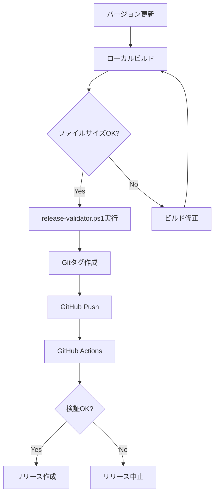

# GitHub Release Rules - 再発防止ガイドライン

## 🚨 重要な教訓
v1.1.5.5リリースで、main.jsが22バイトの壊れたファイルとしてリリースされました。
これによりプラグインが動作せず、ユーザーがインストール/更新できない問題が発生しました。

## ✅ リリース前の必須チェックリスト

### 1. ローカルでのビルド検証
```bash
cd obsidian-multi-git-plugin
npm run build
```

### 2. ファイルサイズ検証
| ファイル | 最小サイズ | 通常サイズ |
|---------|-----------|-----------|
| main.js | 50KB以上 | 約56-60KB |
| manifest.json | 300bytes以上 | 約360bytes |
| styles.css | 5KB以上 | 約7-8KB |

### 3. バージョン整合性チェック
以下の3箇所でバージョンが一致していることを確認：
- [ ] `obsidian-multi-git-plugin/package.json` の "version"
- [ ] `obsidian-multi-git-plugin/manifest.json` の "version"  
- [ ] Gitタグ (例: v1.1.5.6)

## 🔧 GitHub Actions改善点

### 問題のあったコード（修正前）
```yaml
# ❌ 危険：main.jsが存在しない場合、ダミーファイルを作成
if [ ! -f main.js ]; then
  echo "/* Obsidian Plugin */" > release/main.js  # 22バイトのファイル！
```

### 修正後のコード
```yaml
# ✅ 安全：必ずビルドしてから検証
- name: Build plugin
  run: |
    cd obsidian-multi-git-plugin
    npm run build
    
- name: Validate build files
  run: |
    # ファイルサイズチェック
    MAIN_SIZE=$(stat -c%s "main.js")
    if [ $MAIN_SIZE -lt 50000 ]; then
      echo "ERROR: main.js is too small!"
      exit 1
    fi
```

## 📝 手動リリース手順

### PowerShellスクリプトを使用（推奨）
```powershell
# scripts/release-validator.ps1を実行
.\scripts\release-validator.ps1 -Version "1.1.5.6"
```

### 手動でリリースする場合
1. **ビルド**
   ```bash
   cd obsidian-multi-git-plugin
   npm run build
   ```

2. **検証**
   ```bash
   # ファイルサイズ確認
   ls -lh main.js manifest.json styles.css
   ```

3. **リリースフォルダ作成**
   ```bash
   mkdir release-1.1.5.6
   cp main.js manifest.json styles.css release-1.1.5.6/
   ```

4. **ZIP作成**
   ```bash
   cd release-1.1.5.6
   zip -r ../obsidian-multi-git-plugin-1.1.5.6.zip *
   ```

5. **GitHubにアップロード**
   - https://github.com/officefutaro/obsidian-multi-git-plugin/releases/new
   - 必要なファイル：
     - main.js (50KB以上)
     - manifest.json
     - styles.css
     - obsidian-multi-git-plugin-1.1.5.6.zip

## 🛡️ 再発防止策

1. **自動ビルドの必須化**
   - GitHub Actionsは必ず`npm run build`を実行
   - ビルド済みファイルをコミットしない

2. **ファイルサイズ検証**
   - main.jsは50KB以上必須
   - 小さすぎる場合はリリースを中止

3. **ダミーファイル作成の禁止**
   - 「念のため」のダミーファイル作成は絶対にしない
   - ビルドが失敗したらリリースも失敗させる

4. **ローカル検証スクリプトの使用**
   - `scripts/release-validator.ps1`でローカル検証
   - すべてのチェックが通ってからGitHubにプッシュ

## 📊 検証コマンド

### Windows (PowerShell)
```powershell
# ファイルサイズ確認
Get-Item obsidian-multi-git-plugin\main.js | Select-Object Name, Length
```

### macOS/Linux
```bash
# ファイルサイズ確認
stat -c "%n: %s bytes" obsidian-multi-git-plugin/main.js
```

## 🚀 安全なリリースフロー



## ⚠️ 緊急時の対応

もし壊れたリリースを公開してしまった場合：

1. **即座にリリースを削除**
   ```bash
   gh release delete v1.1.5.5 -y
   git push origin :v1.1.5.5  # タグも削除
   ```

2. **修正版を作成**
   - バージョン番号をインクリメント
   - 上記の手順に従って正しくビルド

3. **ユーザーへの通知**
   - README.mdに既知の問題として記載
   - 修正版へのアップデート方法を案内

---
最終更新: 2024-11-28
作成者: Claude Code & officefutaro