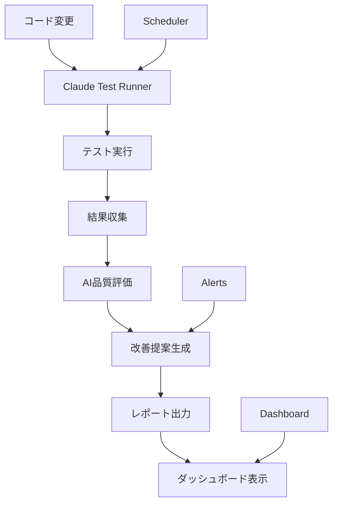

# 🤖 Claude Code AI テストシステム

**Claude Codeによる自動テスト実行・評価・改善提案システム**

---

## 🎯 システム概要

Claude Code AIテストシステムは、Obsidianプラグインの品質を自動的に監視・評価し、継続的な改善を支援します。

### 核心機能
- 🧪 **自動テスト実行**: Jest、統合、E2Eテストの自動実行
- 📊 **AI品質評価**: 10点満点での品質スコア算出
- 💡 **改善提案**: 具体的な改善アクションの提案
- 📈 **トレンド分析**: 品質変化の継続的監視
- 🚨 **アラート機能**: 品質低下の即座検知

---

## 🏗️ システム構成



### コンポーネント

#### 1. 🎮 Claude Test Runner (`claude-test-runner.js`)
```bash
npm run test:ai
```
- テスト実行の中核エンジン
- 環境チェック → ビルド → テスト → 評価
- Markdownレポート自動生成

#### 2. ⏰ AI Test Scheduler (`ai-test-scheduler.js`)
```bash
npm run test:ai-schedule
```
- 定期的な自動テスト実行
- 品質トレンド分析
- アラート機能

#### 3. 📊 AI Test Dashboard (`ai-test-dashboard.js`)
```bash
npm run test:ai-dashboard
npm run test:ai-dashboard-watch  # ウォッチモード
```
- リアルタイム品質モニタリング
- ASCII品質グラフ表示
- アラート表示

---

## 📊 評価システム

### 評価項目と重み
| 項目 | 重み | 説明 |
|-----|------|------|
| **テスト成功率** | 30% | 全テストの成功/失敗率 |
| **カバレッジ** | 25% | コードカバレッジ率 |
| **パフォーマンス** | 20% | 実行時間・速度 |
| **コード品質** | 15% | TypeScript・リンターエラー |
| **セキュリティ** | 10% | セキュリティチェック |

### スコア判定
- **9-10点**: 🟢 Excellent (優秀)
- **7-9点**: 🟡 Good (良好)
- **5-7点**: 🟠 Needs Improvement (改善必要)
- **0-5点**: 🔴 Poor (要対応)

---

## 🚀 使用方法

### 基本操作

#### 1. 即座にテスト実行・評価
```bash
cd obsidian-multi-git-plugin
npm run test:ai
```

#### 2. ダッシュボード表示
```bash
npm run test:ai-dashboard
```

#### 3. 継続監視開始
```bash
npm run test:ai-schedule
```

#### 4. リアルタイムモニタリング
```bash
npm run test:ai-dashboard-watch
```

### 高度な使用法

#### カスタム設定
```javascript
const runner = new ClaudeTestRunner({
  evaluationCriteria: {
    coverage: { weight: 0.3, threshold: 85 },
    performance: { weight: 0.25, threshold: 90 }
  }
});
```

#### 環境変数設定
```bash
export AI_TEST_INTERVAL=1800000  # 30分間隔
export AI_ALERT_THRESHOLD=7.0    # アラート閾値
```

---

## 📈 レポートとダッシュボード

### 生成されるレポート

#### 1. AI評価レポート
```
docs-shared/test-reports/ai-evaluation-YYYY-MM-DD.md
```
- 総合スコアと詳細評価
- テスト結果サマリー
- パフォーマンス分析
- カバレッジ詳細

#### 2. トレンドレポート
```
docs-shared/test-reports/trends/trend-report-YYYY-MM-DD.md
```
- 品質変化トレンド
- 実行履歴
- 推奨アクション

#### 3. ダッシュボードレポート
```
docs-shared/test-reports/dashboard-report-YYYY-MM-DD.md
```
- 総合品質ダッシュボード
- スコア分布
- 詳細推奨事項

### ダッシュボード表示例
```
╔══════════════════════════════════════════════════════════════╗
║                   🤖 Claude Code AI Test Dashboard          ║
║                     Obsidian Plugin Quality Monitor         ║
╚══════════════════════════════════════════════════════════════╝
📅 Last Updated: 2024-10-22 15:30:00

📊 OVERVIEW
══════════
🎯 Latest Score:     8.2/10 🟡
📈 Average Score:    7.8/10
📊 Total Executions: 15
📅 Last Execution:   2024-10-22 15:25:00
📈 Trend:           📈 Improving (Good!)

🕐 RECENT EXECUTIONS
══════════════════
Time                Score   Status              Duration  Recommendations
─────────────────────────────────────────────────────────────────────────
15:25:00      8.2/10  good                1250ms     2
15:20:00      7.9/10  good                1180ms     3
15:15:00      8.0/10  good                1220ms     1
```

---

## 🚨 アラートシステム

### アラートタイプ

#### 1. 品質アラート
- **トリガー**: スコアが閾値以下
- **デフォルト閾値**: 6.0/10
- **ファイル**: `alerts/alert-quality_alert-*.json`

#### 2. クリティカルアラート
- **トリガー**: 連続3回で閾値以下
- **アクション**: 即座対応が必要
- **ファイル**: `alerts/alert-critical_alert-*.json`

#### 3. 実行失敗アラート
- **トリガー**: テスト実行失敗
- **リトライ**: 最大3回
- **ファイル**: `alerts/alert-execution_failure-*.json`

---

## 🎓 改善提案システム

### 自動提案カテゴリ

#### 高優先度 🔴
- テスト失敗の修正
- Git認証エラー
- クリティカルなカバレッジ不足

#### 中優先度 🟡
- パフォーマンス改善
- 軽微なカバレッジ向上
- コード品質改善

#### 低優先度 🟢
- 最適化提案
- ベストプラクティス適用
- ドキュメント改善

### 提案例
```markdown
### 優先度高 🔴
1. Git認証エラーの修正
   - SSH設定確認
   - テスト環境の認証情報更新

### 優先度中 🟡
2. パフォーマンス改善
   - 非同期処理の最適化
   - キャッシュ機能追加

### 優先度低 🟢
3. テストカバレッジ向上
   - utils.ts のテスト追加
   - エッジケーステスト充実
```

---

## 🔧 カスタマイズ

### 評価基準のカスタマイズ
```javascript
// claude-test-runner.js
const customCriteria = {
  coverage: { weight: 0.35, threshold: 90 },
  performance: { weight: 0.15, threshold: 80 },
  success: { weight: 0.35, threshold: 100 },
  quality: { weight: 0.10, threshold: 8.5 },
  security: { weight: 0.05, threshold: 9.5 }
};
```

### スケジュール間隔調整
```javascript
// ai-test-scheduler.js
const scheduler = new AITestScheduler({
  interval: 1800000,        // 30分 (デフォルト: 1時間)
  alertThreshold: 7.5,      // アラート閾値
  maxRetries: 5             // 最大リトライ回数
});
```

### ダッシュボード設定
```javascript
// ai-test-dashboard.js
const dashboard = new AITestDashboard({
  reportDir: './custom-reports',
  refreshInterval: 10000    // 10秒間隔
});
```

---

## 🛡️ セキュリティとプライバシー

### データ保護
- **ローカル実行**: すべての処理はローカル環境内
- **機密データ**: コード内容は外部送信されない
- **暗号化**: 機密設定は暗号化保存

### アクセス制御
- **ファイル権限**: 適切なファイルアクセス権限
- **API制限**: 必要最小限のAPI使用
- **ログ管理**: 機密情報のログ出力防止

---

## 📝 ベストプラクティス

### 日常運用
1. **毎日**: ダッシュボード確認
2. **週次**: トレンドレポート確認
3. **月次**: 評価基準見直し

### 品質向上
1. **即座対応**: スコア6.0以下は即修正
2. **トレンド監視**: 下降トレンドに注意
3. **継続改善**: 提案事項の定期実装

### チーム運用
1. **共有**: ダッシュボードをチーム共有
2. **レビュー**: 週次品質レビュー
3. **目標設定**: 品質目標の設定と追跡

---

## 🚀 次のステップ

### Phase 1 完了 ✅
- [x] 基本AI評価システム
- [x] 自動テスト実行
- [x] ダッシュボード表示
- [x] レポート生成

### Phase 2 計画中
- [ ] 機械学習による予測
- [ ] 自動修正提案
- [ ] Slack/Teams連携
- [ ] モバイル対応

### Phase 3 将来構想
- [ ] 自動コード修正
- [ ] プロジェクト間比較
- [ ] ベンチマーク機能
- [ ] API提供

---

**🎉 Claude Code AIテストシステムで、継続的な品質向上を実現しましょう！**

---
*Generated by Claude Code AI Test System v1.0.0*