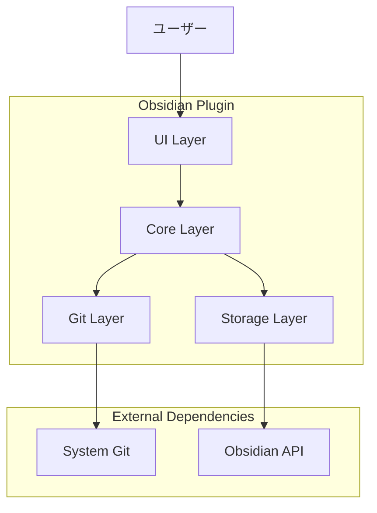
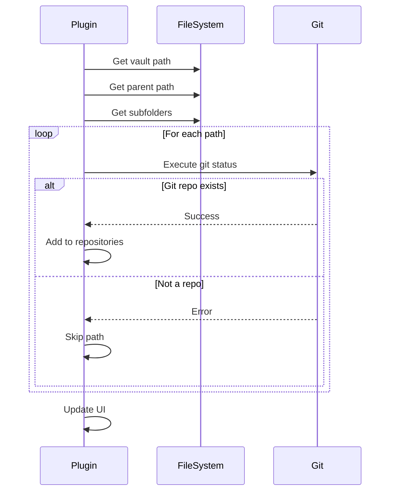
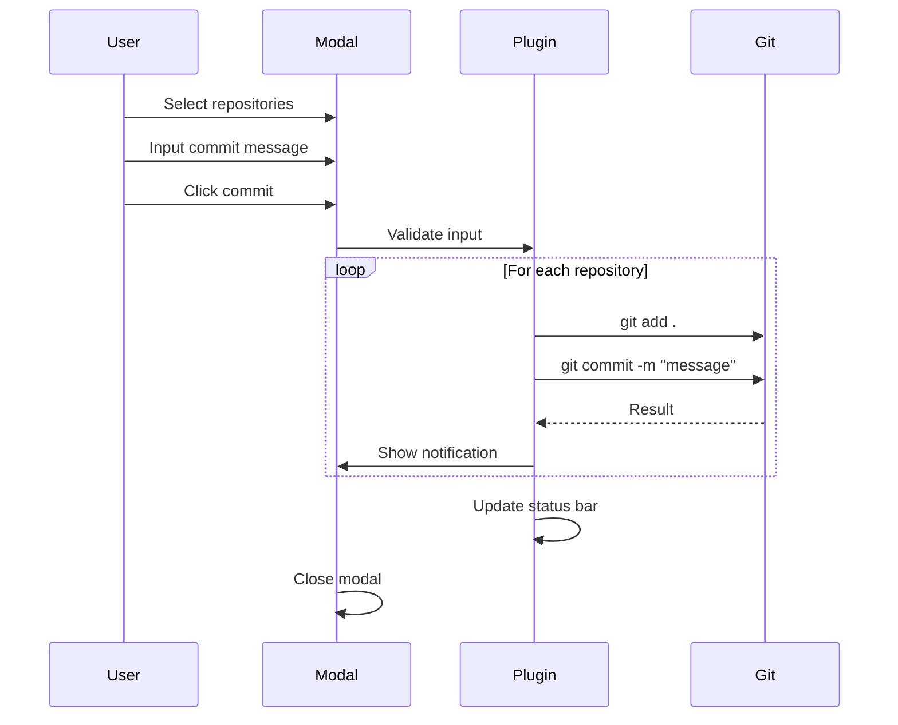
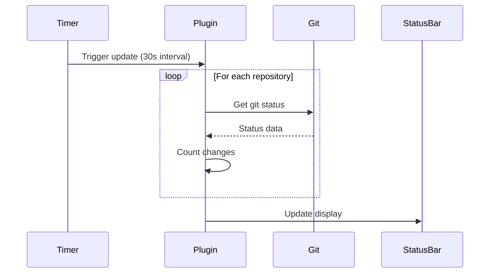
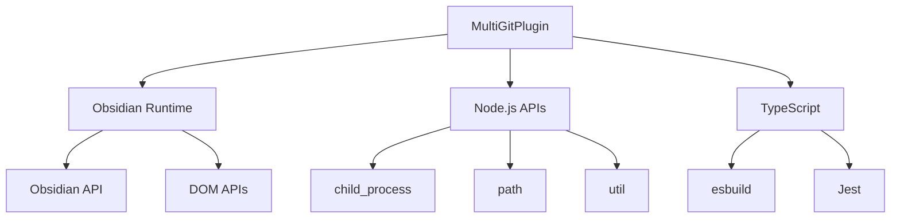

# 技術アーキテクチャ設計書

**プロジェクト**: Obsidian Multi-Git Plugin  
**アーキテクチャ版**: 1.0.0  
**作成日**: 2024年10月22日

---

## 🏗️ システムアーキテクチャ概要

### アーキテクチャ原則
1. **単一責任**: 各コンポーネントは明確な役割を持つ
2. **疎結合**: コンポーネント間の依存性を最小化
3. **拡張性**: 新機能追加が容易な設計
4. **保守性**: 理解しやすく修正しやすいコード
5. **堅牢性**: エラー処理とリカバリ機能

---

## 📐 システム全体設計

### 高レベルアーキテクチャ


### レイヤード アーキテクチャ
| レイヤー | 責任 | 主要コンポーネント |
|---------|------|------------------|
| **Presentation Layer** | UI/UX、ユーザー操作 | Modal Classes, Status Bar |
| **Business Logic Layer** | 業務ロジック、制御フロー | MultiGitPlugin, Git Operations |
| **Data Access Layer** | データ永続化、設定管理 | Settings, File System |
| **Infrastructure Layer** | 外部システム連携 | Git Commands, Obsidian API |

---

## 🧩 コンポーネント設計

### 1. メインプラグインクラス

#### MultiGitPlugin
```typescript
class MultiGitPlugin extends Plugin {
    // State Management
    repositories: GitRepository[]
    statusBarItem: HTMLElement
    
    // Lifecycle
    async onload(): Promise<void>
    onunload(): void
    
    // Repository Management
    async detectRepositories(): Promise<void>
    
    // Git Operations
    async getGitStatus(repoPath: string): Promise<GitStatus>
    async executeGitCommand(repoPath: string, command: string): Promise<string>
    
    // UI Controllers
    showGitStatusModal(): void
    showCommitModal(): void
    gitPush(): void
    gitPull(): void
    
    // Status Management
    async updateStatusBar(): Promise<void>
}
```

**責任**:
- プラグインライフサイクル管理
- リポジトリ検出と管理
- Git操作の調整
- UI コンポーネントの制御

**依存関係**:
- Obsidian Plugin API
- GitRepository, GitStatus interfaces
- Modal classes

---

### 2. データモデル

#### GitRepository
```typescript
interface GitRepository {
    path: string;        // リポジトリの絶対パス
    name: string;        // 表示用名前
    isParent: boolean;   // 親ディレクトリかどうか
}
```

#### GitStatus
```typescript
interface GitStatus {
    modified: string[];   // 変更されたファイル
    added: string[];      // 追加されたファイル
    deleted: string[];    // 削除されたファイル
    untracked: string[];  // 未追跡ファイル
    branch: string;       // 現在のブランチ
    ahead: number;        // リモートより先行するコミット数
    behind: number;       // リモートより遅れているコミット数
}
```

**設計決定**:
- 単純なインターフェースで型安全性を確保
- Git の状態を網羅的にモデル化
- 将来の拡張性を考慮した構造

---

### 3. UIコンポーネント設計

#### コンポーネント階層
```
MultiGitPlugin
├── StatusBar Component
├── Ribbon Icon Component
└── Modal Components
    ├── GitStatusModal
    ├── GitCommitModal
    └── GitOperationModal
```

#### GitStatusModal
```typescript
class GitStatusModal extends Modal {
    plugin: MultiGitPlugin
    
    constructor(app: App, plugin: MultiGitPlugin)
    async onOpen(): Promise<void>
    onClose(): void
}
```

**責任**:
- 全リポジトリのGit状態表示
- ファイル変更の視覚的表現
- ユーザーフレンドリーなステータス表示

#### GitCommitModal
```typescript
class GitCommitModal extends Modal {
    plugin: MultiGitPlugin
    selectedRepos: Set<string>
    
    constructor(app: App, plugin: MultiGitPlugin)
    async onOpen(): Promise<void>
    onClose(): void
}
```

**責任**:
- リポジトリ選択UI
- コミットメッセージ入力
- コミット操作の実行

#### GitOperationModal
```typescript
class GitOperationModal extends Modal {
    plugin: MultiGitPlugin
    operation: 'push' | 'pull'
    selectedRepos: Set<string>
    
    constructor(app: App, plugin: MultiGitPlugin, operation: 'push' | 'pull')
    async onOpen(): Promise<void>
    onClose(): void
}
```

**責任**:
- Push/Pull操作の統一UI
- リポジトリ選択
- 操作結果の表示

---

## 🔄 データフロー設計

### 1. リポジトリ検出フロー


### 2. Git操作フロー


### 3. 状態更新フロー


---

## 🗄️ データ永続化設計

### 現在の設計（v1.0）
- **設定データ**: なし（将来実装予定）
- **状態データ**: メモリ内のみ（再起動時に再検出）
- **キャッシュ**: なし（毎回Git実行）

### 将来の設計（v2.0以降）
```typescript
interface PluginSettings {
    autoRefresh: boolean
    refreshInterval: number
    defaultCommitMessage: string
    showParentRepo: boolean
    excludePatterns: string[]
    confirmDestructive: boolean
    repositorySettings: { [path: string]: RepoSettings }
}

interface RepoSettings {
    autoCommit: boolean
    customCommitTemplate: string
    excludeFromBulkOperations: boolean
}
```

**永続化戦略**:
- Obsidianのプラグイン設定機能を使用
- JSON形式でのシリアライゼーション
- 設定変更の即座反映

---

## ⚡ パフォーマンス設計

### 1. 非同期処理戦略
```typescript
// 並列Git操作
async executeParallelGitOperations(repos: GitRepository[], operation: string) {
    const operations = repos.map(repo => 
        this.executeGitCommand(repo.path, operation)
    )
    
    return Promise.allSettled(operations)
}

// バックグラウンド更新
async updateStatusInBackground() {
    // UIをブロックしない非同期更新
    setTimeout(() => this.updateStatusBar(), 0)
}
```

### 2. キャッシング戦略（将来実装）
```typescript
interface GitStatusCache {
    [repoPath: string]: {
        status: GitStatus
        timestamp: number
        ttl: number
    }
}

class GitStatusCacheManager {
    private cache: GitStatusCache = {}
    private readonly TTL = 30000 // 30秒
    
    async getStatus(repoPath: string): Promise<GitStatus> {
        const cached = this.cache[repoPath]
        if (cached && Date.now() - cached.timestamp < cached.ttl) {
            return cached.status
        }
        
        const status = await this.fetchGitStatus(repoPath)
        this.cache[repoPath] = {
            status,
            timestamp: Date.now(),
            ttl: this.TTL
        }
        
        return status
    }
}
```

### 3. メモリ管理
- イベントリスナーの適切なクリーンアップ
- タイマーの適切な停止処理
- DOM要素の適切な削除

---

## 🛡️ エラーハンドリング設計

### エラー分類とハンドリング戦略

#### 1. システムエラー
```typescript
enum SystemError {
    GIT_NOT_FOUND = 'git_not_found',
    PERMISSION_DENIED = 'permission_denied',
    NETWORK_ERROR = 'network_error'
}

class ErrorHandler {
    handleSystemError(error: SystemError, context: string): void {
        switch (error) {
            case SystemError.GIT_NOT_FOUND:
                new Notice('Gitが見つかりません。Gitをインストールしてください。')
                break
            case SystemError.PERMISSION_DENIED:
                new Notice(`権限エラー: ${context}`)
                break
            case SystemError.NETWORK_ERROR:
                new Notice('ネットワークエラーが発生しました。')
                break
        }
    }
}
```

#### 2. Git操作エラー
```typescript
async executeGitCommand(repoPath: string, command: string): Promise<string> {
    try {
        const { stdout, stderr } = await execAsync(`git ${command}`, { cwd: repoPath })
        return stdout || stderr
    } catch (error) {
        const e = error as ExecException
        
        if (e.code === 128) {
            throw new GitError('Git操作に失敗しました', e.message)
        } else if (e.code === 1) {
            throw new GitError('Git認証エラー', e.message)
        } else {
            throw new GitError('不明なGitエラー', e.message)
        }
    }
}
```

#### 3. ユーザー入力エラー
```typescript
validateCommitMessage(message: string): ValidationResult {
    if (!message.trim()) {
        return { isValid: false, error: 'コミットメッセージを入力してください' }
    }
    
    if (message.length > 500) {
        return { isValid: false, error: 'コミットメッセージが長すぎます（500文字以内）' }
    }
    
    return { isValid: true }
}
```

---

## 🔌 外部システム統合

### 1. Obsidian API統合
```typescript
// Obsidian APIの適切な使用
class ObsidianIntegration {
    constructor(private app: App) {}
    
    getVaultPath(): string {
        return (this.app.vault.adapter as any).basePath
    }
    
    getAllFolders(): string[] {
        return this.app.vault.getAllLoadedFiles()
            .filter(f => f.children)
            .map(f => f.path)
    }
    
    showNotification(message: string, timeout?: number): void {
        new Notice(message, timeout)
    }
}
```

### 2. Git システム統合
```typescript
class GitIntegration {
    private readonly GIT_COMMANDS = {
        STATUS: 'status --porcelain',
        ADD_ALL: 'add .',
        COMMIT: (message: string) => `commit -m "${message.replace(/"/g, '\\"')}"`,
        PUSH: 'push',
        PULL: 'pull',
        BRANCH: 'branch --show-current',
        REMOTE_STATUS: (branch: string) => `rev-list --left-right --count origin/${branch}...HEAD`
    }
    
    async executeCommand(repoPath: string, command: string): Promise<string> {
        // コマンド実行の統一インターフェース
    }
}
```

---

## 🧪 テスト アーキテクチャ

### テスト戦略
```
Testing Architecture
├── Unit Tests (Jest)
│   ├── Business Logic Tests
│   ├── Data Model Tests
│   └── Utility Function Tests
├── Integration Tests
│   ├── Git Operation Tests
│   ├── File System Tests
│   └── Obsidian API Tests
├── UI Tests
│   ├── Modal Behavior Tests
│   ├── User Interaction Tests
│   └── Visual Regression Tests
└── E2E Tests
    ├── Complete Workflow Tests
    ├── Multi-Repository Tests
    └── Error Scenario Tests
```

### モック戦略
```typescript
// Obsidian APIモック
const mockObsidianAPI = {
    vault: {
        adapter: { basePath: '/test/vault' },
        getAllLoadedFiles: () => mockFiles
    },
    workspace: { /* ... */ }
}

// Git操作モック
const mockGitOperations = {
    execAsync: jest.fn().mockImplementation((command, options) => {
        // Git コマンドのモック実装
    })
}
```

---

## 📈 拡張性設計

### 1. プラグインアーキテクチャ（将来）
```typescript
interface GitOperation {
    execute(repoPath: string, params?: any): Promise<string>
    validate(params?: any): boolean
    getDescription(): string
}

class GitOperationRegistry {
    private operations = new Map<string, GitOperation>()
    
    register(name: string, operation: GitOperation): void {
        this.operations.set(name, operation)
    }
    
    execute(name: string, repoPath: string, params?: any): Promise<string> {
        const operation = this.operations.get(name)
        if (!operation) throw new Error(`Operation ${name} not found`)
        
        return operation.execute(repoPath, params)
    }
}
```

### 2. イベントシステム（将来）
```typescript
interface GitEvent {
    type: 'commit' | 'push' | 'pull' | 'status_change'
    repository: string
    data?: any
    timestamp: number
}

class GitEventEmitter extends EventTarget {
    emit(event: GitEvent): void {
        this.dispatchEvent(new CustomEvent(event.type, { detail: event }))
    }
    
    on(type: string, listener: (event: CustomEvent<GitEvent>) => void): void {
        this.addEventListener(type, listener)
    }
}
```

---

## 🔧 設定とカスタマイゼーション

### 設定アーキテクチャ（将来実装）
```typescript
class SettingsManager {
    private settings: PluginSettings
    private readonly defaults: PluginSettings = {
        autoRefresh: true,
        refreshInterval: 30,
        defaultCommitMessage: '',
        showParentRepo: true,
        excludePatterns: ['node_modules/**', '.git/**'],
        confirmDestructive: true
    }
    
    async loadSettings(): Promise<void> {
        this.settings = Object.assign({}, this.defaults, await this.plugin.loadData())
    }
    
    async saveSettings(): Promise<void> {
        await this.plugin.saveData(this.settings)
    }
    
    get<K extends keyof PluginSettings>(key: K): PluginSettings[K] {
        return this.settings[key]
    }
    
    set<K extends keyof PluginSettings>(key: K, value: PluginSettings[K]): void {
        this.settings[key] = value
        this.saveSettings()
    }
}
```

---

## 📊 監視とロギング

### ログシステム（将来実装）
```typescript
enum LogLevel {
    DEBUG = 0,
    INFO = 1,
    WARN = 2,
    ERROR = 3
}

class Logger {
    constructor(private level: LogLevel = LogLevel.INFO) {}
    
    debug(message: string, ...args: any[]): void {
        if (this.level <= LogLevel.DEBUG) {
            console.debug(`[MultiGit] ${message}`, ...args)
        }
    }
    
    info(message: string, ...args: any[]): void {
        if (this.level <= LogLevel.INFO) {
            console.info(`[MultiGit] ${message}`, ...args)
        }
    }
    
    error(message: string, error?: Error): void {
        console.error(`[MultiGit] ${message}`, error)
    }
}
```

---

## 🔗 依存関係管理

### 依存関係図


### バージョン管理
```json
{
  "peerDependencies": {
    "obsidian": "^1.0.0"
  },
  "devDependencies": {
    "typescript": "^5.0.0",
    "esbuild": "^0.19.0",
    "jest": "^29.0.0"
  },
  "engines": {
    "node": ">=16.0.0"
  }
}
```

---

**最終更新**: 2024年10月22日  
**承認者**: futaro  
**アーキテクト**: Claude AI Assistant