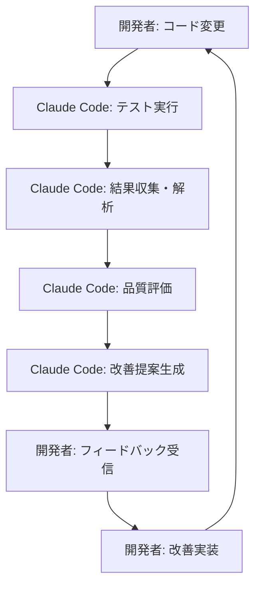

# AI支援テスト戦略 - Claude Code連携

**作成日**: 2024年10月22日  
**対象プロジェクト**: Obsidian Multi-Git Plugin  
**AI エンジン**: Claude Code

---

## 🤖 AI支援テストの概要

Claude Codeがテスト実行から結果評価、改善提案まで自動化し、人間の開発者をサポートします。

### 基本フロー


---

## 🎯 AI評価の対象領域

### 1. テスト結果解析
- **成功/失敗パターン分析**
- **カバレッジギャップ特定**
- **パフォーマンス劣化検知**
- **エラーメッセージ解釈**

### 2. コード品質評価
- **テストコードの妥当性**
- **エッジケースカバレッジ**
- **テスト設計パターン**
- **保守性評価**

### 3. 改善提案
- **不足テストケース**
- **リファクタリング提案**
- **パフォーマンス最適化**
- **セキュリティ強化**

---

## 🔧 実装アーキテクチャ

### 1. テスト実行エンジン
```typescript
interface AITestRunner {
  executeTests(): Promise<TestResults>;
  collectMetrics(): TestMetrics;
  analyzeResults(results: TestResults): QualityAssessment;
  generateRecommendations(assessment: QualityAssessment): Recommendations;
}
```

### 2. 評価基準
```yaml
評価項目:
  - テスト成功率: weight=0.3
  - カバレッジ: weight=0.25
  - パフォーマンス: weight=0.2
  - コード品質: weight=0.15
  - セキュリティ: weight=0.1

スコア計算:
  - 10点満点
  - 8点以上: 優秀
  - 6-8点: 良好
  - 4-6点: 改善必要
  - 4点未満: 要対応
```

### 3. 自動実行トリガー
- **プッシュ時**: 全テスト→AI評価
- **PR作成時**: 差分テスト→AI評価
- **定期実行**: 夜間フルテスト→AI評価
- **手動実行**: 開発者要求時

---

## 📊 AI評価レポート形式

### 1. エグゼクティブサマリー
```markdown
## テスト評価レポート
**実行日時**: 2024-10-22 15:30:00
**総合スコア**: 8.2/10 ✅
**ステータス**: 良好

### 主な所見
- カバレッジが目標の80%を達成
- パフォーマンステストで軽微な劣化を検知
- セキュリティテストは全て合格
```

### 2. 詳細分析
```markdown
### テスト結果詳細
| カテゴリ | 実行数 | 成功 | 失敗 | スキップ | スコア |
|---------|-------|------|------|---------|--------|
| ユニット | 45 | 44 | 1 | 0 | 9.8 |
| 統合 | 12 | 12 | 0 | 0 | 10.0 |
| E2E | 8 | 7 | 1 | 0 | 8.8 |

### 発見された問題
1. **Git操作テスト失敗**: authentication error
2. **パフォーマンス**: 前回比15%遅延
3. **カバレッジ**: src/utils.ts 65%のみ
```

### 3. 改善提案
```markdown
### 優先度高 🔴
1. Git認証エラーの修正
   - SSH設定確認
   - テスト環境の認証情報更新

### 優先度中 🟡
2. パフォーマンス改善
   - 非同期処理の最適化
   - キャッシュ機能追加

### 優先度低 🟢
3. テストカバレッジ向上
   - utils.ts のテスト追加
   - エッジケーステスト充実
```

---

## 🚀 実装ステップ

### Phase 1: 基本AI評価 (今週)
- [ ] テスト結果収集システム
- [ ] 基本評価アルゴリズム
- [ ] シンプルなレポート生成

### Phase 2: 高度分析 (来週)
- [ ] コード品質解析
- [ ] パフォーマンス評価
- [ ] セキュリティチェック

### Phase 3: 改善提案 (来月)
- [ ] 具体的改善提案
- [ ] 自動修正候補
- [ ] 学習機能

---

## 🎓 AI学習データ

### 評価基準の学習
- **成功パターン**: 高品質テストの特徴
- **失敗パターン**: よくある問題とその解決策
- **ベストプラクティス**: 業界標準との比較

### 継続的改善
- **フィードバックループ**: 開発者の採用/却下率
- **精度向上**: 予測と実際の結果比較
- **パターン認識**: 新しい問題パターンの学習

---

## 🔒 セキュリティとプライバシー

### データ保護
- **コード非送信**: ローカル解析のみ
- **結果暗号化**: 機密情報の保護
- **アクセス制御**: 権限ベースアクセス

### AI利用ポリシー
- **透明性**: 評価ロジックの公開
- **説明可能性**: 判断根拠の明示
- **人間の最終判断**: AIは支援のみ

---

## 📈 成功指標

### 短期目標 (1ヶ月)
- AI評価精度: 85%以上
- 改善提案採用率: 60%以上
- テスト実行時間短縮: 20%

### 中期目標 (3ヶ月)
- バグ発見率向上: 40%
- 開発者満足度: 4.5/5以上
- テスト品質スコア: 8.5/10以上

### 長期目標 (6ヶ月)
- 完全自動化率: 90%
- 予防的問題発見: 月10件以上
- プロダクト品質向上: 50%

---

## 🔧 技術仕様

### API インターフェース
```typescript
interface ClaudeTestEvaluator {
  runTestSuite(): Promise<TestResults>;
  evaluateQuality(results: TestResults): QualityScore;
  generateReport(score: QualityScore): EvaluationReport;
  suggestImprovements(report: EvaluationReport): Recommendation[];
}
```

### 設定ファイル
```json
{
  "aiEvaluation": {
    "enabled": true,
    "thresholds": {
      "coverage": 80,
      "performance": 100,
      "quality": 8.0
    },
    "reportFormat": "markdown",
    "notifications": {
      "slack": true,
      "email": false
    }
  }
}
```

---

**次のステップ**: テスト戦略更新完了後、AI評価システムの実装開始