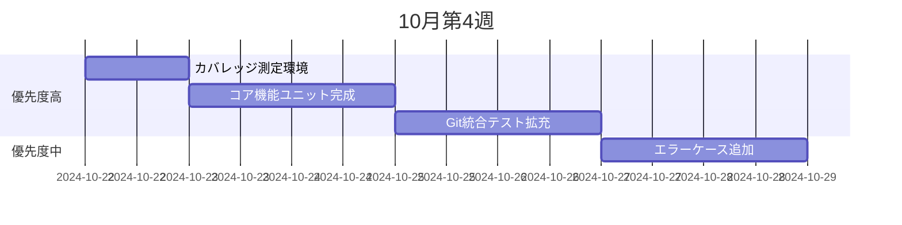
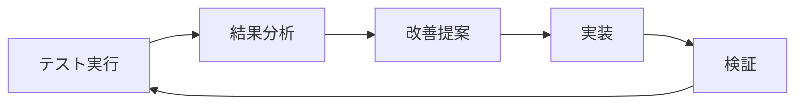

# テストロードマップ 2024 Q4
**期間**: 2024年10月22日 - 2024年12月31日  
**プロジェクト**: Obsidian Multi-Git Plugin  
**目標**: プロダクション品質のテスト体制確立

---

## 🎯 四半期目標

### 主要KPI
| 指標 | 現在 | 10月末 | 11月末 | 12月末 |
|-----|------|--------|--------|--------|
| コードカバレッジ | 0% | 60% | 75% | 85% |
| 自動化率 | 35% | 60% | 80% | 90% |
| バグ検出率 | - | 50% | 70% | 80% |
| CI成功率 | - | 90% | 95% | 98% |
| テスト実行時間 | 40秒 | 45秒 | 50秒 | 60秒 |

---

## 📅 月別計画

### 🗓 10月（残り10日）
**テーマ**: 基盤確立とカバレッジ向上

#### Week 4 (10/22-10/28)


**成果物**:
- [ ] カバレッジレポート初版
- [ ] コア機能テスト100%完了
- [ ] Git基本操作テスト完成
- [ ] エラーハンドリングテスト30%

#### Week 5 (10/29-10/31)
**タスク**:
- [ ] E2Eシナリオ作成（3本）
- [ ] パフォーマンスベースライン測定
- [ ] 月次レビュー実施

---

### 🗓 11月
**テーマ**: 網羅性向上と自動化推進

#### Week 1 (11/1-11/7)
**重点エリア**: UI/UXテスト
- [ ] 設定画面テスト実装
- [ ] リボンアイコンテスト
- [ ] ステータスバーテスト
- [ ] ホットキーテスト

#### Week 2 (11/8-11/14)
**重点エリア**: 高度なGit操作
- [ ] ブランチ管理テスト
- [ ] マージ/リベーステスト
- [ ] コンフリクト解決テスト
- [ ] 認証処理テスト

#### Week 3 (11/15-11/21)
**重点エリア**: エッジケース
- [ ] 大規模vault（1000+ファイル）
- [ ] 巨大ファイル（10MB+）
- [ ] 特殊文字ファイル名
- [ ] ネットワーク断続

#### Week 4 (11/22-11/30)
**重点エリア**: パフォーマンス
- [ ] ベンチマークスイート作成
- [ ] メモリリークテスト
- [ ] 負荷テスト
- [ ] 最適化実施

**11月成果物**:
- カバレッジ75%達成
- E2Eシナリオ10本
- パフォーマンス改善20%
- バグ修正15件

---

### 🗓 12月
**テーマ**: 品質保証と安定化

#### Week 1 (12/1-12/7)
**重点エリア**: セキュリティ
- [ ] 認証情報保護テスト
- [ ] インジェクション対策
- [ ] サニタイゼーション
- [ ] 権限管理

#### Week 2 (12/8-12/14)
**重点エリア**: 互換性
- [ ] Obsidian各バージョンテスト
- [ ] プラットフォーム固有テスト
- [ ] プラグイン間干渉テスト
- [ ] 後方互換性

#### Week 3 (12/15-12/21)
**重点エリア**: リリース準備
- [ ] リグレッションテスト
- [ ] スモークテスト
- [ ] ユーザー受け入れテスト
- [ ] ドキュメント最終化

#### Week 4 (12/22-12/31)
**重点エリア**: 振り返りと計画
- [ ] 四半期レビュー
- [ ] メトリクス分析
- [ ] 2025 Q1計画
- [ ] ナレッジ整理

**12月成果物**:
- カバレッジ85%達成
- リリース候補版
- 完全なテストドキュメント
- 2025年計画書

---

## 🚀 実装優先順位

### P0: 即座対応（今週中）
1. **カバレッジ測定開始**
   - 担当: 自動化チーム
   - 期限: 10/23
   - ブロッカー: なし

2. **コア機能テスト完成**
   - 担当: 開発チーム
   - 期限: 10/25
   - 依存: なし

### P1: 高優先度（10月中）
3. **Git操作統合テスト**
   - 担当: 統合チーム
   - 期限: 10/28
   - 依存: テスト環境

4. **エラーケース基本**
   - 担当: QAチーム
   - 期限: 10/31
   - 依存: コア機能テスト

### P2: 中優先度（11月中）
5. **UI/UXテスト**
6. **高度なGit機能**
7. **パフォーマンステスト**
8. **エッジケース**

### P3: 低優先度（12月）
9. **セキュリティテスト**
10. **互換性テスト**
11. **ビジュアルテスト**
12. **国際化テスト**

---

## 📊 リスク管理

### 特定リスクと軽減策
| リスク | 確率 | 影響 | 軽減策 | 期限 |
|-------|-----|------|--------|------|
| カバレッジ目標未達 | 中 | 高 | 早期測定開始 | 10/23 |
| CI/CD障害 | 低 | 高 | バックアップ環境 | 11/15 |
| リソース不足 | 中 | 中 | 優先順位明確化 | 継続 |
| 技術的負債 | 高 | 中 | 定期的リファクタ | 毎週 |

---

## 🎓 スキル開発

### 必要スキル習得計画
| スキル | 現在 | 目標 | 方法 | 期限 |
|-------|-----|------|------|------|
| Jest詳細 | 基礎 | 応用 | ドキュメント学習 | 10/31 |
| Git内部 | 中級 | 上級 | 実践演習 | 11/30 |
| E2E設計 | 初級 | 中級 | ベストプラクティス | 11/15 |
| パフォーマンス | 初級 | 中級 | プロファイリング | 12/15 |

---

## 💰 リソース配分

### 工数見積もり（人日）
```
10月（残）: 8人日
11月: 20人日
12月: 15人日
合計: 43人日
```

### 工数配分
```
ユニットテスト: 35% (15人日)
統合テスト: 25% (11人日)
E2Eテスト: 20% (8人日)
ドキュメント: 10% (4人日)
インフラ: 10% (5人日)
```

---

## 📈 成功基準

### 四半期末達成条件
- ✅ コードカバレッジ85%以上
- ✅ 全重要機能の自動テスト
- ✅ CI/CD完全自動化
- ✅ バグ検出率80%以上
- ✅ テスト実行時間60秒以内
- ✅ ゼロクリティカルバグ

### ストレッチゴール
- 🎯 カバレッジ90%
- 🎯 モバイルテスト環境
- 🎯 ビジュアルリグレッション
- 🎯 国際化対応

---

## 🔄 レビューとフィードバック

### 定期レビュー
| イベント | 頻度 | 参加者 | アジェンダ |
|---------|------|--------|-----------|
| デイリー | 毎日 | 開発 | 進捗確認 |
| ウィークリー | 週次 | チーム全体 | 課題解決 |
| マンスリー | 月次 | ステークホルダー | KPI確認 |
| 四半期 | 3ヶ月 | 経営層 | 戦略見直し |

### フィードバックループ


---

## 📝 次のアクション

### 今日（10/22）
1. [ ] カバレッジツール設定
2. [ ] 残存ユニットテスト特定
3. [ ] 週次計画詳細化

### 今週（10/22-10/28）
1. [ ] カバレッジ60%達成
2. [ ] Git統合テスト完成
3. [ ] E2Eシナリオ3本

### 今月（10月末まで）
1. [ ] 基盤確立完了
2. [ ] ドキュメント整備
3. [ ] 11月計画詳細化

---

**作成者**: Claude AI Assistant  
**承認者**: futaro  
**次回更新**: 2024年10月29日（週次レビュー）