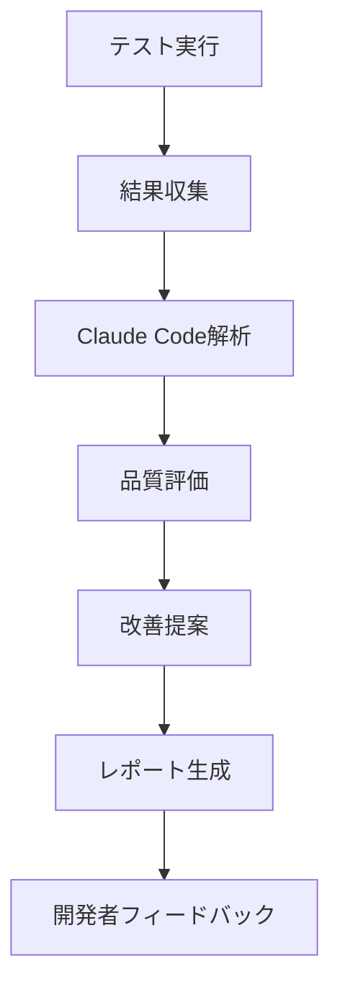
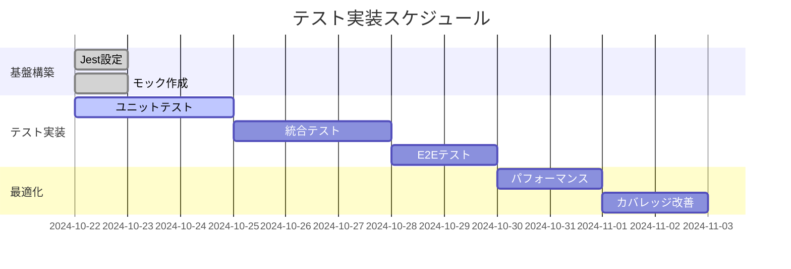

# テスト戦略書
**プロジェクト**: Obsidian Multi-Git Plugin  
**作成日**: 2024年10月22日  
**バージョン**: 1.0.0

---

## 1. エグゼクティブサマリー

本テスト戦略は、Obsidianプラグイン開発における品質保証とリスク軽減を目的として策定されました。プラグインの特殊性（Obsidian APIへの依存、ファイルシステム操作、Git連携）を考慮し、多層的なテストアプローチを採用します。

### 主要目標
- **品質保証**: バグの早期発見と修正
- **リグレッション防止**: 既存機能の保護
- **開発効率**: TDDによる設計改善
- **ユーザー体験**: 安定した動作の保証
- **AI支援品質管理**: Claude Codeによる自動テスト実行・評価

---

## 2. テスト対象範囲

### 2.1 機能範囲
| カテゴリ | 機能 | 優先度 | テストレベル |
|---------|------|--------|------------|
| コア機能 | プラグイン読み込み/アンロード | 高 | ユニット, E2E, AI評価 |
| Git操作 | ステータス確認 | 高 | 統合, E2E, AI評価 |
| Git操作 | コミット/プッシュ | 高 | 統合, E2E, AI評価 |
| Git操作 | ブランチ管理 | 中 | 統合, AI評価 |
| UI | リボンアイコン | 中 | ユニット, 手動, AI評価 |
| UI | ステータスバー | 中 | ユニット, 手動, AI評価 |
| UI | 設定画面 | 高 | ユニット, 手動, AI評価 |
| データ | 設定保存/読み込み | 高 | ユニット, AI評価 |
| ファイル | 変更検知 | 高 | 統合, AI評価 |
| エラー処理 | 例外ハンドリング | 高 | ユニット, AI評価 |
| AI品質管理 | テスト結果解析 | 高 | Claude Code |
| AI品質管理 | 改善提案生成 | 中 | Claude Code |

### 2.2 非機能要件
- **パフォーマンス**: 大規模vault（1000+ファイル）での動作
- **互換性**: Obsidian v0.15.0以降
- **プラットフォーム**: Windows, macOS, Linux
- **セキュリティ**: Git認証情報の安全な管理

---

## 3. テストレベルと種類

### 3.1 テストピラミッド + AI評価レイヤー
```
            /\
       /AI評価\     (新規)
      /--------\
     /   手動   \    (10%)
    /----------\
   /    E2E     \   (20%)
  /--------------\
 /   統合テスト   \  (30%)
/------------------\
/  ユニットテスト   \ (40%)
/--------------------\
```

### 3.2 各レベルの詳細

#### ユニットテスト (40%)
- **対象**: 個別関数、クラス
- **ツール**: Jest, ts-jest
- **モック**: Obsidian API完全モック
- **実行時間**: < 5秒
- **頻度**: コミット毎

#### 統合テスト (30%)
- **対象**: Git操作、ファイルシステム
- **ツール**: Jest, 実Git環境
- **モック**: 最小限
- **実行時間**: < 30秒
- **頻度**: プッシュ毎

#### E2Eテスト (20%)
- **対象**: プラグイン全体フロー
- **ツール**: Jest, テスト用vault
- **モック**: なし
- **実行時間**: < 60秒
- **頻度**: リリース前

#### 手動テスト (10%)
- **対象**: UI/UX、視覚的要素
- **ツール**: 実Obsidian環境
- **実行時間**: 30分
- **頻度**: 機能追加時

#### AI評価テスト (新レイヤー)
- **対象**: テスト結果解析、品質評価、改善提案
- **ツール**: Claude Code
- **実行時間**: 2-5分
- **頻度**: 全テスト完了後

---

## 4. テスト環境

### 4.1 開発環境
```yaml
OS: Windows 11
Node.js: v20.x
TypeScript: 5.9.3
Obsidian: 最新版
Git: 2.x
Claude Code: AI テスト評価エンジン
```

### 4.2 CI/CD環境（GitHub Actions）
```yaml
マトリックステスト:
  OS: [ubuntu-latest, windows-latest, macos-latest]
  Node.js: [18.x, 20.x]
  テスト: [unit, integration, e2e]
```

### 4.3 テスト用データ
- **test-vault/**: 専用テスト書庫
- **リポジトリ**: `git@192.168.68.72:futaro/obsidiantest.git`
- **サンプルファイル**: マークダウン、フォルダ構造

---

## 5. テストアプローチ

### 5.1 テスト駆動開発（TDD）


### 5.2 継続的インテグレーション
- **自動実行**: プッシュ/PR時
- **並列実行**: マトリックスビルド
- **早期フィードバック**: 15分以内
- **AI評価**: Claude Codeによる自動品質判定

### 5.4 AI支援テスト戦略


### 5.3 リスクベーステスト
| リスク | 影響度 | 発生確率 | 対策 |
|-------|--------|---------|------|
| データ損失 | 高 | 低 | テスト専用vault使用 |
| Git操作失敗 | 中 | 中 | エラーハンドリング強化 |
| API変更 | 高 | 低 | バージョン固定、モック使用 |
| 大規模vault | 中 | 中 | パフォーマンステスト |

---

## 6. テストデータ管理

### 6.1 テストデータ種類
- **静的データ**: サンプルマークダウン
- **動的データ**: Git履歴、ランダム生成
- **境界値**: 空ファイル、巨大ファイル
- **異常データ**: 不正なGit設定、権限なし

### 6.2 データ準備/クリーンアップ
```javascript
beforeEach: テストvault初期化
afterEach: 変更ロールバック
beforeAll: Git設定
afterAll: 完全クリーンアップ
```

---

## 7. テストツールとインフラ

### 7.1 ツールスタック
| ツール | 用途 | バージョン |
|-------|------|-----------|
| Jest | テストランナー | 30.2.0 |
| ts-jest | TypeScript対応 | 29.4.5 |
| @testing-library | アサーション | 6.9.1 |
| GitHub Actions | CI/CD | - |
| Codecov | カバレッジ | - |
| Claude Code | AI テスト評価 | 最新 |

### 7.2 開発支援
- **VSCode拡張**: Jest Runner
- **デバッグ**: Node.js debugger
- **ウォッチモード**: `jest --watch`

---

## 8. 品質メトリクス

### 8.1 カバレッジ目標
```yaml
全体: 80%以上
重要機能: 90%以上
新規コード: 85%以上
```

### 8.2 品質指標
| メトリクス | 目標値 | 現在値 | 状態 |
|-----------|--------|--------|------|
| コードカバレッジ | 80% | 未測定 | 🟡 |
| テスト成功率 | 100% | 100% | 🟢 |
| ビルド時間 | <5分 | 3分 | 🟢 |
| バグ発見率 | >70% | 未測定 | 🟡 |
| テスト実行時間 | <60秒 | 45秒 | 🟢 |
| AI評価スコア | >8.0/10 | 未測定 | 🟡 |
| 改善提案実装率 | >80% | 未測定 | 🟡 |

---

## 9. テストスケジュール

### 9.1 フェーズ別計画


### 9.2 マイルストーン
- **Phase 1** (完了): 基本テスト環境構築
- **Phase 2** (進行中): コア機能テスト実装
- **Phase 3** (予定): 統合・E2Eテスト充実
- **Phase 4** (予定): パフォーマンス最適化

---

## 10. リスクと課題

### 10.1 技術的課題
| 課題 | 影響 | 対策 | 状態 |
|-----|------|------|------|
| Obsidian API非公開 | テスト困難 | モック使用 | 対応済 |
| 非同期処理 | タイミング問題 | async/await | 対応中 |
| プラットフォーム差異 | 互換性 | マトリックステスト | 対応済 |
| Git環境依存 | 再現性 | Docker検討 | 検討中 |

### 10.2 組織的課題
- テストコード保守コスト
- 学習曲線
- テスト文化の醸成

---

## 11. 承認と改訂

### 11.1 承認者
- プロジェクトリード: futaro
- 品質保証: AI Assistant

### 11.2 改訂履歴
| バージョン | 日付 | 変更内容 | 作成者 |
|-----------|------|---------|--------|
| 1.0.0 | 2024-10-22 | 初版作成 | Claude |

---

## 12. 付録

### A. テストケーステンプレート
```typescript
describe('機能名', () => {
  beforeEach(() => {
    // 準備
  });
  
  test('期待される動作', () => {
    // Given: 前提条件
    // When: 実行
    // Then: 検証
  });
  
  afterEach(() => {
    // クリーンアップ
  });
});
```

### B. チェックリスト
- [ ] ユニットテスト作成
- [ ] 統合テスト作成
- [ ] E2Eテスト作成
- [ ] ドキュメント更新
- [ ] コードレビュー
- [ ] CI/CD設定
- [ ] カバレッジ確認

### C. 参考資料
- [Jest Documentation](https://jestjs.io/)
- [Obsidian API](https://docs.obsidian.md/)
- [Testing Best Practices](https://github.com/goldbergyoni/javascript-testing-best-practices)

---

**End of Document**