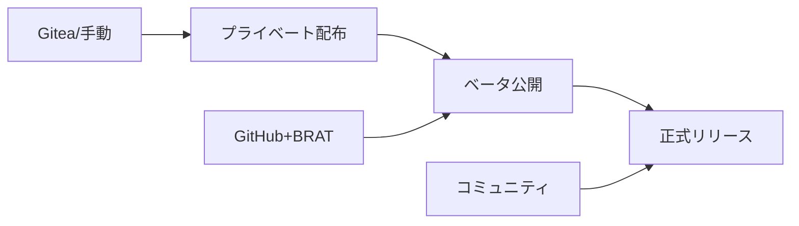

# Obsidian Multi Git Plugin 公開トライ方法検討

**作成日**: 2025年10月26日  
**目的**: 段階的な公開アプローチの検討と実施計画

---

## 🎯 1. 公開戦略の全体像

### 1.1 3段階アプローチ


### 1.2 各段階の目的と期間
| 段階 | 目的 | 期間 | 対象者 |
|------|------|------|--------|
| **Phase 1** | 機能検証 | 1週間 | 開発者のみ |
| **Phase 2** | 安定性確認 | 2-4週間 | 20-50名 |
| **Phase 3** | 一般公開 | 継続 | 全ユーザー |

---

## 📊 2. 現状分析

### 2.1 準備完了項目 ✅
- プラグイン本体（main.js, manifest.json, styles.css）
- 基本機能（複数リポジトリ管理、UI）
- ドキュメント（日本語版完成）
- 自動インストーラー（3種類）

### 2.2 準備必要項目 🔄
- GitHubリポジトリ作成
- 英語ドキュメント作成
- テストカバレッジ改善（3.28%→80%）
- コミュニティフィードバック収集

---

## 🚀 3. Phase 1: プライベート配布（現在実施可能）

### 3.1 Gitea配布
```powershell
# 既に実装済みの方法
irm "http://192.168.68.72:3000/futaro/obsidian-multi-git-plugin/raw/branch/master/obsidian-multi-git-plugin/install.ps1" | iex
```

**メリット**:
- 完全にコントロール可能
- 即座に修正・更新可能
- プライベートな環境で安全

**デメリット**:
- 外部ユーザーアクセス不可
- フィードバック限定的

### 3.2 手動配布
```powershell
# ZIP配布用パッケージ作成
Compress-Archive -Path main.js, manifest.json, styles.css -DestinationPath obsidian-multi-git-v1.0.0.zip
```

**配布方法**:
1. ZIPファイルをメール/チャットで送付
2. 受信者が手動でプラグインフォルダに配置
3. Obsidian再起動で有効化

---

## 🔬 4. Phase 2: ベータ公開（GitHub + BRAT）

### 4.1 GitHub移行計画

#### Step 1: リポジトリ準備（Day 1）
```bash
# 新リポジトリ作成
git remote add github https://github.com/[USERNAME]/obsidian-multi-git-plugin.git
git push github master
```

#### Step 2: リリース作成（Day 2）
```yaml
# GitHub Actionsでの自動リリース
name: Release
on:
  push:
    tags:
      - 'v*'
jobs:
  release:
    runs-on: ubuntu-latest
    steps:
      - uses: actions/checkout@v3
      - run: npm ci && npm run build
      - uses: softprops/action-gh-release@v1
        with:
          files: |
            main.js
            manifest.json
            styles.css
```

#### Step 3: BRAT配布開始（Day 3-）
告知文テンプレート:
```markdown
## 🚀 Obsidian Multi Git Plugin - Beta Testing

BRAT経由でベータテスト参加者募集中！

### インストール方法
1. BRAT プラグインをインストール
2. BRAT設定で以下を追加: https://github.com/[USERNAME]/obsidian-multi-git-plugin
3. プラグインを有効化

### フィードバック
- Issues: バグ報告
- Discussions: 機能提案
- Discord: #plugin-testing
```

### 4.2 ベータテスト実施計画

#### Week 1: 初期テスター募集（5-10名）
- 身近な開発者・パワーユーザー
- 詳細なフィードバック収集
- 致命的バグの早期発見

#### Week 2-3: 拡大テスト（20-50名）
- Reddit r/ObsidianMD で募集
- Discord コミュニティで告知
- 多様な環境での動作確認

#### Week 4: 安定版準備
- フィードバック反映
- ドキュメント最終化
- パフォーマンス最適化

---

## 🏆 5. Phase 3: 正式リリース

### 5.1 コミュニティプラグイン申請タイミング

#### 申請基準チェック
```yaml
技術基準:
  ✅ TypeScript実装
  ✅ 適切なエラーハンドリング
  🔄 テストカバレッジ80%以上
  ✅ セキュリティ確保

コミュニティ基準:
  🔄 Star数5以上
  🔄 アクティブメンテナンス証明
  ✅ 包括的ドキュメント
  🔄 ユーザーフィードバック
```

### 5.2 申請前の最終準備
1. **品質改善スプリント**（1週間）
   - テストカバレッジ80%達成
   - パフォーマンス最適化
   - セキュリティ監査

2. **ドキュメント完成**（3日）
   - 英語README完成
   - 動画チュートリアル作成
   - FAQ整備

3. **コミュニティ構築**（継続）
   - GitHub Discussions開設
   - サポート体制確立
   - 貢献者ガイドライン作成

---

## 📈 6. 成功指標とマイルストーン

### 6.1 Phase別KPI

| Phase | 指標 | 目標 | 測定方法 |
|-------|------|------|----------|
| **Phase 1** | インストール成功率 | 100% | 直接確認 |
| **Phase 2** | ベータテスター数 | 20-50名 | BRAT統計 |
| | バグ報告数 | <10件 | GitHub Issues |
| | 満足度 | 4.0/5.0 | アンケート |
| **Phase 3** | ダウンロード数 | 100+/月 | Community Stats |
| | Star数 | 50+/6ヶ月 | GitHub |
| | 継続率 | 70%+ | Analytics |

### 6.2 Go/No-Go判断基準

#### Phase 1 → Phase 2
- ✅ 基本機能の動作確認
- ✅ 致命的バグなし
- ✅ インストール手順確立

#### Phase 2 → Phase 3  
- 🔄 20名以上のベータテスター
- 🔄 重大バグ全て解決
- 🔄 英語ドキュメント完成
- 🔄 テストカバレッジ80%

---

## 🎯 7. 推奨実施順序

### 今すぐ実施
1. ✅ Gitea/手動での個人利用継続
2. ✅ test-vaultでの長期安定性テスト

### 1週間以内
1. GitHubアカウント作成/確認
2. リポジトリ移行実施
3. 初回リリース作成

### 2週間以内
1. BRAT配布開始
2. ベータテスター募集
3. フィードバック収集開始

### 1ヶ月以内
1. テストカバレッジ改善
2. 英語ドキュメント作成
3. コミュニティプラグイン申請準備

---

## 💡 8. リスク管理

### 8.1 技術的リスク
| リスク | 対策 | 緊急度 |
|--------|------|--------|
| GitHub Actions制限 | ローカルビルド準備 | 低 |
| BRAT非対応環境 | 手動インストール案内 | 中 |
| API互換性問題 | バージョン固定 | 高 |

### 8.2 コミュニティリスク
| リスク | 対策 | 緊急度 |
|--------|------|--------|
| 低評価レビュー | 迅速サポート | 高 |
| 類似プラグイン | 差別化強調 | 中 |
| メンテナンス負荷 | 自動化推進 | 中 |

---

## 📋 9. 結論と次のアクション

### 9.1 現時点での最適アプローチ
**「Phase 1完了 → Phase 2準備」**が現実的

理由:
- 基本機能は完成済み
- Gitea環境で即座にテスト可能
- GitHub移行は技術的に簡単

### 9.2 具体的な次の3ステップ
1. **今日**: Gitea環境での長期テスト継続
2. **今週**: GitHubリポジトリ作成、初回push
3. **来週**: BRAT配布準備、ベータ告知文作成

### 9.3 成功の鍵
- **段階的アプローチ**: 急がず着実に
- **フィードバック重視**: ユーザーの声を最優先
- **品質優先**: カバレッジ改善を怠らない

---

*検討実施日: 2025年10月26日*  
*次回レビュー: 2025年11月2日予定*