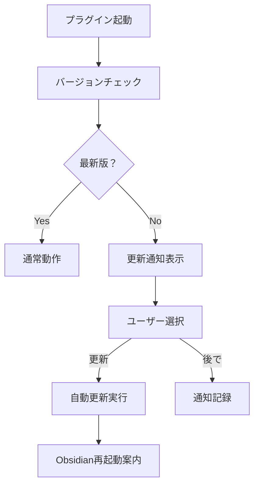

# 🔄 Multi Git Manager - アップデート管理システム

## 📋 概要

このドキュメントでは、Multi Git Managerプラグインのバージョン管理、更新配信、および自動アップデート機能について説明します。

---

## 🏷️ バージョン管理戦略

### 📊 バージョニング規則

```
Major.Minor.Patch[-PreRelease][+BuildMetadata]
例: 1.2.3-beta1+20241026
```

#### バージョン番号の意味
- **Major (1.x.x)**: 破壊的変更、大幅な機能追加
- **Minor (x.1.x)**: 新機能追加、後方互換性あり
- **Patch (x.x.1)**: バグ修正、軽微な改善
- **PreRelease**: alpha, beta, rc (リリース候補)
- **BuildMetadata**: ビルド日時、コミットハッシュ

### 🚀 リリースタイプ

| タイプ | 頻度 | 目的 | 例 |
|--------|------|------|-----|
| **🔥 Hotfix** | 即座 | 緊急バグ修正 | `1.0.1` |
| **📦 Patch** | 週1回 | 通常バグ修正 | `1.0.2` |
| **✨ Minor** | 月1回 | 新機能追加 | `1.1.0` |
| **🎯 Major** | 四半期 | 大規模変更 | `2.0.0` |
| **🧪 Beta** | 随時 | テスト版 | `1.1.0-beta1` |

---

## 🔄 自動更新システム

### 📡 更新チェック機能

#### 更新確認フロー


#### 実装例
```typescript
// src/updater.ts
export class UpdateManager {
    private giteaUrl = 'http://192.168.68.72:3000';
    private repo = 'futaro/obsidian-multi-git-plugin';
    
    async checkForUpdates(): Promise<UpdateInfo | null> {
        try {
            const response = await fetch(`${this.giteaUrl}/api/v1/repos/${this.repo}/releases/latest`);
            const release = await response.json();
            
            const latestVersion = release.tag_name;
            const currentVersion = this.plugin.manifest.version;
            
            if (this.isNewerVersion(latestVersion, currentVersion)) {
                return {
                    version: latestVersion,
                    downloadUrl: release.assets,
                    releaseNotes: release.body
                };
            }
        } catch (error) {
            console.warn('Update check failed:', error);
        }
        
        return null;
    }
    
    async performUpdate(updateInfo: UpdateInfo): Promise<boolean> {
        try {
            // 1. ファイルをダウンロード
            const files = ['main.js', 'manifest.json', 'styles.css'];
            for (const file of files) {
                await this.downloadFile(file, updateInfo.downloadUrl);
            }
            
            // 2. 成功通知
            new Notice('更新完了！Obsidianを再起動してください。');
            return true;
        } catch (error) {
            new Notice('更新に失敗しました: ' + error.message);
            return false;
        }
    }
}
```

### ⚙️ 更新設定

```typescript
// settings.ts
interface UpdateSettings {
    autoCheck: boolean;           // 自動チェック有効/無効
    checkInterval: number;        // チェック間隔（時間）
    channel: 'stable' | 'beta';  // 更新チャンネル
    notifyLevel: 'all' | 'major' | 'none'; // 通知レベル
}

const DEFAULT_SETTINGS: UpdateSettings = {
    autoCheck: true,
    checkInterval: 24, // 24時間
    channel: 'stable',
    notifyLevel: 'all'
};
```

---

## 📦 更新配信システム

### 🌐 Gitea API活用

#### リリース情報取得
```bash
# 最新リリース取得
curl http://192.168.68.72:3000/api/v1/repos/futaro/obsidian-multi-git-plugin/releases/latest

# 全リリース一覧
curl http://192.168.68.72:3000/api/v1/repos/futaro/obsidian-multi-git-plugin/releases

# 特定バージョン取得
curl http://192.168.68.72:3000/api/v1/repos/futaro/obsidian-multi-git-plugin/releases/tags/v1.0.0
```

#### レスポンス例
```json
{
  "id": 123,
  "tag_name": "v1.1.0",
  "name": "Version 1.1.0 - New Features",
  "body": "## New Features\n- Git branch switching\n- Improved error handling\n\n## Bug Fixes\n- Fixed memory leak",
  "created_at": "2024-10-26T10:00:00Z",
  "published_at": "2024-10-26T10:30:00Z",
  "assets": [
    {
      "name": "main.js",
      "browser_download_url": "http://192.168.68.72:3000/futaro/obsidian-multi-git-plugin/releases/download/v1.1.0/main.js"
    }
  ]
}
```

### 🔧 更新スクリプト改良

#### バージョン指定インストール
```powershell
# PowerShell: 特定バージョンのインストール
$VERSION = "v1.0.0"
$url = "http://192.168.68.72:3000/futaro/obsidian-multi-git-plugin/raw/tag/$VERSION/install.ps1"
irm $url | iex
```

```bash
# Bash: 特定バージョンのインストール
VERSION="v1.0.0"
curl -sSL "http://192.168.68.72:3000/futaro/obsidian-multi-git-plugin/raw/tag/$VERSION/install.sh" | bash
```

#### 更新専用スクリプト
```bash
#!/bin/bash
# update.sh - 更新専用スクリプト

GITEA_URL="http://192.168.68.72:3000"
REPO="futaro/obsidian-multi-git-plugin"

echo "🔄 Multi Git Manager Update Check"

# 現在のバージョンを取得
CURRENT_VERSION=$(cat ~/.config/obsidian/*/plugins/multi-git-manager/manifest.json | jq -r '.version' 2>/dev/null)
echo "Current version: $CURRENT_VERSION"

# 最新バージョンを取得
LATEST_VERSION=$(curl -s "$GITEA_URL/api/v1/repos/$REPO/releases/latest" | jq -r '.tag_name')
echo "Latest version: $LATEST_VERSION"

# バージョン比較
if [ "$CURRENT_VERSION" != "$LATEST_VERSION" ]; then
    echo "📦 Update available: $CURRENT_VERSION → $LATEST_VERSION"
    read -p "Update now? (y/n): " UPDATE
    
    if [ "$UPDATE" = "y" ]; then
        curl -sSL "$GITEA_URL/$REPO/raw/branch/master/install.sh" | bash
    fi
else
    echo "✅ Already up to date"
fi
```

---

## 🎯 更新チャンネル管理

### 📻 チャンネル設定

#### Stable（安定版）
- **対象**: 一般ユーザー
- **頻度**: 月1-2回
- **内容**: 十分テストされた機能のみ

#### Beta（ベータ版）
- **対象**: ベータテスター
- **頻度**: 週1-2回
- **内容**: 新機能の事前テスト版

#### Nightly（開発版）
- **対象**: 開発者
- **頻度**: 毎日
- **内容**: 最新の開発コード

### 🏷️ タグ管理

```bash
# リリースタグの作成
git tag -a v1.1.0 -m "Release version 1.1.0"
git push origin v1.1.0

# ベータタグの作成
git tag -a v1.2.0-beta1 -m "Beta release 1.2.0-beta1"
git push origin v1.2.0-beta1

# プレリリースタグの作成
git tag -a v2.0.0-rc1 -m "Release candidate 2.0.0-rc1"
git push origin v2.0.0-rc1
```

---

## 🔔 通知システム

### 📢 更新通知UI

```typescript
// notification.ts
export class UpdateNotification {
    showUpdateAvailable(updateInfo: UpdateInfo) {
        const modal = new Modal(this.app);
        modal.titleEl.setText('🔄 アップデート利用可能');
        
        const content = modal.contentEl;
        content.createEl('h3', { text: `Version ${updateInfo.version} が利用可能です` });
        
        // リリースノート表示
        const notesEl = content.createEl('div', { cls: 'update-notes' });
        notesEl.innerHTML = this.parseMarkdown(updateInfo.releaseNotes);
        
        // ボタン
        const buttonContainer = content.createEl('div', { cls: 'update-buttons' });
        
        const updateBtn = buttonContainer.createEl('button', { 
            text: '今すぐ更新',
            cls: 'mod-cta'
        });
        updateBtn.onclick = () => {
            this.performUpdate(updateInfo);
            modal.close();
        };
        
        const laterBtn = buttonContainer.createEl('button', { 
            text: '後で更新'
        });
        laterBtn.onclick = () => {
            this.scheduleReminder(updateInfo);
            modal.close();
        };
        
        modal.open();
    }
}
```

### 📅 リマインダー機能

```typescript
// reminder.ts
export class UpdateReminder {
    private reminderInterval: number = 24 * 60 * 60 * 1000; // 24時間
    
    scheduleReminder(updateInfo: UpdateInfo) {
        const reminderTime = Date.now() + this.reminderInterval;
        localStorage.setItem('mgm-update-reminder', JSON.stringify({
            version: updateInfo.version,
            reminderTime: reminderTime
        }));
    }
    
    checkReminders() {
        const reminderData = localStorage.getItem('mgm-update-reminder');
        if (reminderData) {
            const reminder = JSON.parse(reminderData);
            if (Date.now() >= reminder.reminderTime) {
                this.showReminder(reminder.version);
                localStorage.removeItem('mgm-update-reminder');
            }
        }
    }
}
```

---

## 📊 ダウングレード機能

### ⬇️ バージョンロールバック

```typescript
// rollback.ts
export class VersionRollback {
    private backupDir: string;
    
    async createBackup(version: string): Promise<void> {
        const pluginDir = this.getPluginDirectory();
        const backupPath = path.join(this.backupDir, `backup-${version}-${Date.now()}`);
        
        await fs.copy(pluginDir, backupPath);
        console.log(`Backup created: ${backupPath}`);
    }
    
    async rollbackToVersion(version: string): Promise<boolean> {
        try {
            // 1. バックアップを作成
            await this.createBackup(this.getCurrentVersion());
            
            // 2. 指定バージョンをダウンロード
            await this.downloadVersion(version);
            
            // 3. 成功通知
            new Notice(`バージョン ${version} にロールバックしました`);
            return true;
        } catch (error) {
            new Notice(`ロールバックに失敗: ${error.message}`);
            return false;
        }
    }
}
```

### 📦 バックアップ管理

```typescript
// backup.ts
interface BackupInfo {
    version: string;
    timestamp: number;
    files: string[];
}

export class BackupManager {
    private maxBackups = 5;
    
    async cleanOldBackups(): Promise<void> {
        const backups = await this.listBackups();
        
        // 古いバックアップから削除
        backups.sort((a, b) => b.timestamp - a.timestamp);
        
        for (let i = this.maxBackups; i < backups.length; i++) {
            await this.deleteBackup(backups[i]);
        }
    }
    
    async restoreFromBackup(backupInfo: BackupInfo): Promise<void> {
        const pluginDir = this.getPluginDirectory();
        const backupPath = this.getBackupPath(backupInfo);
        
        // プラグインディレクトリを削除
        await fs.remove(pluginDir);
        
        // バックアップから復元
        await fs.copy(backupPath, pluginDir);
        
        new Notice(`バックアップから復元しました: ${backupInfo.version}`);
    }
}
```

---

## 🧪 テスト自動化

### 🔬 更新プロセステスト

```typescript
// update.test.ts
describe('Update System', () => {
    test('should detect newer version', () => {
        const manager = new UpdateManager();
        
        expect(manager.isNewerVersion('1.1.0', '1.0.0')).toBe(true);
        expect(manager.isNewerVersion('1.0.1', '1.0.0')).toBe(true);
        expect(manager.isNewerVersion('2.0.0', '1.9.9')).toBe(true);
        expect(manager.isNewerVersion('1.0.0', '1.0.0')).toBe(false);
    });
    
    test('should handle beta versions', () => {
        const manager = new UpdateManager();
        
        expect(manager.isNewerVersion('1.1.0-beta1', '1.0.0')).toBe(true);
        expect(manager.isNewerVersion('1.1.0', '1.1.0-beta1')).toBe(true);
    });
    
    test('should download files correctly', async () => {
        const manager = new UpdateManager();
        const mockUpdateInfo = {
            version: '1.1.0',
            downloadUrl: 'http://example.com/files/',
            releaseNotes: 'Test release'
        };
        
        const result = await manager.performUpdate(mockUpdateInfo);
        expect(result).toBe(true);
    });
});
```

### 🚀 CI/CD統合

```yaml
# .gitea/workflows/test-updates.yml
name: Test Update System

on:
  push:
    branches: [ master, develop ]
  pull_request:
    branches: [ master ]

jobs:
  test-updates:
    runs-on: ubuntu-latest
    
    steps:
      - uses: actions/checkout@v4
      
      - name: Setup Node.js
        uses: actions/setup-node@v4
        with:
          node-version: '18.x'
      
      - name: Install dependencies
        run: npm install
      
      - name: Test update system
        run: npm run test:update
      
      - name: Test rollback system
        run: npm run test:rollback
      
      - name: Test notification system
        run: npm run test:notifications
```

---

## 📈 統計・監視

### 📊 更新統計収集

```typescript
// analytics.ts
interface UpdateStats {
    version: string;
    updateTime: number;
    previousVersion: string;
    method: 'auto' | 'manual' | 'script';
    success: boolean;
    errorMessage?: string;
}

export class UpdateAnalytics {
    async recordUpdate(stats: UpdateStats): Promise<void> {
        // ローカルストレージに記録
        const history = this.getUpdateHistory();
        history.push(stats);
        
        // 最新100件のみ保持
        if (history.length > 100) {
            history.splice(0, history.length - 100);
        }
        
        localStorage.setItem('mgm-update-history', JSON.stringify(history));
    }
    
    getUpdateSuccessRate(): number {
        const history = this.getUpdateHistory();
        const successful = history.filter(update => update.success).length;
        return history.length > 0 ? successful / history.length : 0;
    }
}
```

### 📋 管理ダッシュボード

```typescript
// dashboard.ts
export class UpdateDashboard {
    createDashboard(): HTMLElement {
        const container = createDiv({ cls: 'update-dashboard' });
        
        // 現在のバージョン情報
        const versionInfo = container.createDiv({ cls: 'version-info' });
        versionInfo.createEl('h3', { text: 'バージョン情報' });
        versionInfo.createEl('p', { text: `現在: ${this.getCurrentVersion()}` });
        versionInfo.createEl('p', { text: `最新: ${this.getLatestVersion()}` });
        
        // 更新履歴
        const updateHistory = container.createDiv({ cls: 'update-history' });
        updateHistory.createEl('h3', { text: '更新履歴' });
        this.renderUpdateHistory(updateHistory);
        
        // 統計情報
        const stats = container.createDiv({ cls: 'update-stats' });
        stats.createEl('h3', { text: '統計' });
        this.renderStats(stats);
        
        return container;
    }
}
```

---

## 🛡️ セキュリティ考慮事項

### 🔒 ダウンロード検証

```typescript
// security.ts
export class SecurityManager {
    async verifyDownload(file: string, expectedHash?: string): Promise<boolean> {
        if (!expectedHash) return true;
        
        const fileBuffer = await fs.readFile(file);
        const hash = crypto.createHash('sha256').update(fileBuffer).digest('hex');
        
        return hash === expectedHash;
    }
    
    async verifySignature(file: string, signature: string): Promise<boolean> {
        // デジタル署名の検証
        // 実装は署名方式により異なる
        return true;
    }
}
```

### 🌐 通信セキュリティ

```typescript
// secure-fetch.ts
export class SecureFetch {
    private async fetchWithRetry(url: string, options: RequestInit = {}): Promise<Response> {
        const maxRetries = 3;
        let attempt = 0;
        
        while (attempt < maxRetries) {
            try {
                const response = await fetch(url, {
                    ...options,
                    timeout: 30000, // 30秒タイムアウト
                });
                
                if (response.ok) {
                    return response;
                }
                
                throw new Error(`HTTP ${response.status}: ${response.statusText}`);
            } catch (error) {
                attempt++;
                if (attempt >= maxRetries) {
                    throw error;
                }
                
                // 指数バックオフ
                await new Promise(resolve => setTimeout(resolve, Math.pow(2, attempt) * 1000));
            }
        }
        
        throw new Error('Max retries exceeded');
    }
}
```

---

**🔄 効率的なアップデート管理で、常に最新のMutli Git Managerをお楽しみください！**

---

*このドキュメントは Multi Git Manager v1.0.0+ 向けです*  
*最終更新: 2024年10月26日*