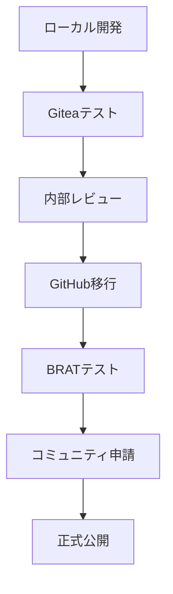
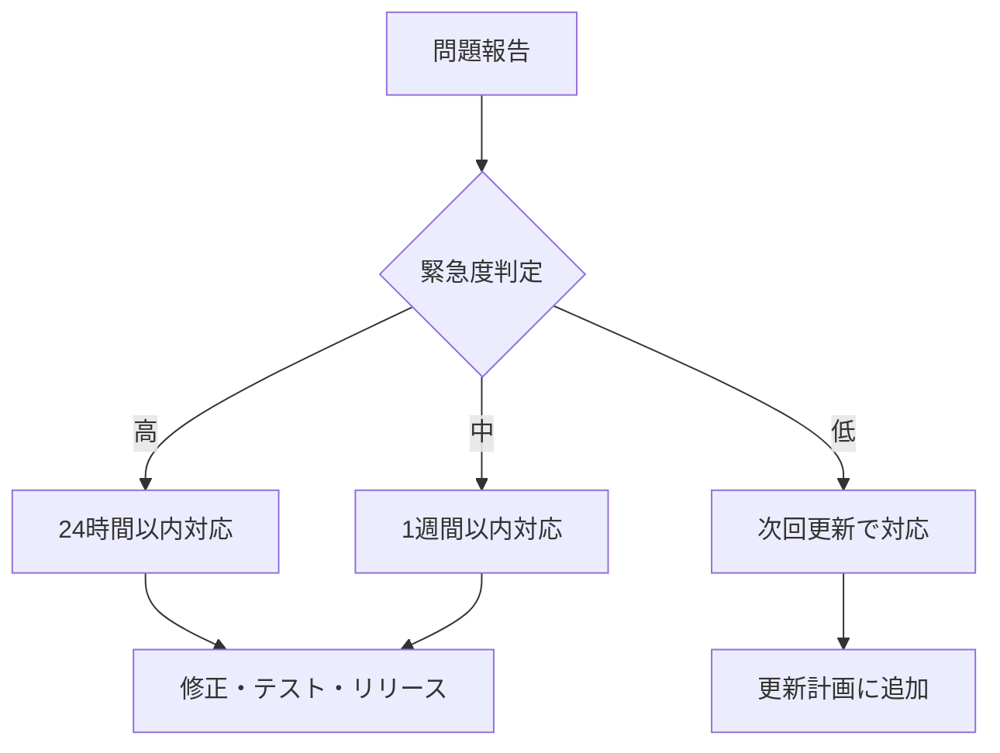

# 🚀 Obsidianプラグイン公開戦略ガイド

## 📊 公開戦略の概要

### 🎯 段階的公開アプローチ


## 🏠 Phase 1: Giteaプライベートテスト

### ✅ 目的
- **安全な環境**: 公開前の十分なテスト
- **完全制御**: プライベートサーバーでの検証
- **リスク軽減**: 問題発生時の影響範囲限定

### 🔧 実装内容
- **Docker環境**: `docker-compose.yml`でGitea起動
- **CI/CD**: `.gitea/workflows/`で自動テスト
- **リリース**: 自動パッケージング
- **ドキュメント**: 完全な日本語ドキュメント

### 📋 チェックリスト
- [ ] Giteaサーバー起動確認
- [ ] リポジトリ作成・プッシュ
- [ ] CI/CDパイプライン動作確認
- [ ] リリースファイル生成確認
- [ ] 手動インストールテスト
- [ ] プラグイン機能テスト

## 🌐 Phase 2: GitHub移行準備

### 📦 必要ファイル整備

#### 必須ファイル
```
obsidian-multi-git-plugin/
├── main.js              # ビルド済みプラグイン
├── manifest.json        # プラグイン設定
├── styles.css          # スタイルシート
├── README.md           # 英語版概要
├── LICENSE             # MITライセンス
└── versions.json       # バージョン履歴
```

#### ドキュメント
```
docs/
├── INSTALLATION.md     # インストール手順
├── QUICK-START.md     # クイックガイド
├── USER-GUIDE.md      # 詳細ガイド
├── PUBLISH-GUIDE.md   # 公開手順
├── CHANGELOG.md       # 変更履歴
└── CONTRIBUTING.md    # 貢献ガイド
```

### 🔄 移行手順
```bash
# 1. GitHubリポジトリ作成
# 2. リモート追加
git remote add github https://github.com/[USERNAME]/obsidian-multi-git-plugin.git

# 3. 全ブランチ・タグ移行
git push github main
git push github --tags

# 4. GitHub Actions設定
cp .gitea/workflows/ .github/workflows/
# GITEA_TOKEN → GITHUB_TOKEN に変更

# 5. README.md英語化
# 日本語版 → 英語版に翻訳・調整
```

## 🧪 Phase 3: BRATテスト

### 🎯 Beta Release Automatic Testing

#### BRAT設定
```json
{
  "name": "Multi Git Manager",
  "description": "Manage multiple Git repositories in Obsidian",
  "repo": "USERNAME/obsidian-multi-git-plugin",
  "branch": "main"
}
```

#### テストユーザー募集
```markdown
# Beta Test募集

## 対象
- Obsidianヘビーユーザー
- Git使用経験者  
- フィードバック提供可能な方

## テスト期間
2週間（バグ修正・改善実施）

## テスト内容
- [ ] インストール手順
- [ ] 基本機能動作
- [ ] パフォーマンス
- [ ] ドキュメント分かりやすさ
- [ ] エラーハンドリング
```

### 📊 フィードバック収集
- **GitHub Issues**: バグ報告
- **Discussions**: 機能要望・使用感
- **Discord/Forum**: リアルタイム相談

## 📝 Phase 4: コミュニティプラグイン申請

### 📋 申請前チェック

#### コード品質
- [ ] **テストカバレッジ**: 80%以上
- [ ] **TypeScript**: 型安全性確保
- [ ] **ESLint/Prettier**: コード規約準拠
- [ ] **パフォーマンス**: 大規模Vaultでテスト済み

#### セキュリティ
- [ ] **ファイルアクセス**: 適切な制限
- [ ] **外部通信**: 不要な通信なし
- [ ] **機密情報**: ハードコード禁止
- [ ] **権限**: 最小権限の原則

#### ユーザビリティ
- [ ] **エラーメッセージ**: 分かりやすい表現
- [ ] **設定画面**: 直感的なUI
- [ ] **ドキュメント**: 完全性・正確性
- [ ] **多言語対応**: 英語必須

### 🎯 obsidian-releases PR作成

#### community-plugins.json編集
```json
{
  "id": "multi-git-manager",
  "name": "Multi Git Manager", 
  "author": "Your Name",
  "description": "Efficiently manage multiple Git repositories within Obsidian",
  "repo": "USERNAME/obsidian-multi-git-plugin"
}
```

#### PR テンプレート
```markdown
# Add Multi Git Manager Plugin

## Plugin Information
- **Name**: Multi Git Manager
- **ID**: multi-git-manager  
- **Description**: Manage multiple Git repositories including parent directories
- **Author**: Your Name
- **Repo**: https://github.com/USERNAME/obsidian-multi-git-plugin

## Checklist
- [x] The plugin has a GitHub release with required files
- [x] The plugin ID is unique in community-plugins.json
- [x] The description is clear and concise
- [x] The plugin follows Obsidian plugin guidelines
- [x] I have tested the plugin extensively
- [x] Documentation is complete and accurate

## First Release
- Version: 1.0.0
- Min Obsidian Version: 1.0.0
- Desktop Only: Yes

## Testing
- [x] Basic functionality verified
- [x] Performance tested with large vaults
- [x] Error handling implemented
- [x] Security review completed

## Screenshots
[Add plugin interface screenshots]
```

## 📈 Phase 5: 継続的メンテナンス

### 🔄 定期更新サイクル

#### バージョン管理戦略
```
1.0.x - パッチ更新（バグ修正）
1.x.0 - マイナー更新（機能追加）
x.0.0 - メジャー更新（破壊的変更）
```

#### リリーススケジュール
- **緊急バグ修正**: 即座
- **定期バグ修正**: 月1回
- **機能追加**: 四半期1回
- **メジャー更新**: 年1回

### 📊 メトリクス監視

#### ダウンロード統計
- **GitHub Releases**: ダウンロード数
- **Obsidian統計**: インストール数
- **Star数**: 人気度指標

#### ユーザーフィードバック
- **Issues**: 問題報告数・解決率
- **Discussions**: 活発度
- **Rating**: ユーザー満足度

### 🤝 コミュニティ貢献

#### オープンソース運営
```markdown
# 貢献者歓迎

## 貢献方法
- 🐛 **バグ報告**: Issue作成
- 💡 **機能提案**: Discussion投稿  
- 🔧 **コード貢献**: Pull Request
- 📝 **ドキュメント**: 改善・翻訳

## 行動規範
- 建設的なフィードバック
- 初心者にも優しく
- 技術的議論を重視
- 多様性を尊重
```

## 🎯 成功指標

### 📊 量的指標
| 指標 | 目標値 | 期間 |
|------|--------|------|
| **ダウンロード数** | 1,000+ | 6ヶ月 |
| **GitHubスター** | 100+ | 1年 |
| **アクティブユーザー** | 500+ | 1年 |
| **バグ報告解決率** | 90%+ | 継続 |

### 🎨 質的指標
- **ユーザー満足度**: 高評価レビュー
- **コミュニティ活性化**: 活発な議論
- **エコシステム貢献**: 他プラグインとの連携
- **技術的影響**: 開発手法の参考

## 🔮 将来展望

### 🚀 ロードマップ

#### 短期（6ヶ月）
- [ ] コミュニティプラグイン承認
- [ ] 安定版リリース
- [ ] ユーザーベース確立
- [ ] バグ修正・パフォーマンス改善

#### 中期（1年） 
- [ ] 高度な機能追加（ブランチ管理等）
- [ ] 他プラグインとの連携
- [ ] モバイル対応検討
- [ ] API拡張

#### 長期（2年+）
- [ ] エンタープライズ機能
- [ ] クラウド同期連携
- [ ] AI支援機能
- [ ] プラットフォーム拡張

---

## 📞 サポート体制

### 🆘 問題対応フロー


### 📚 ドキュメント維持
- **英語**: メイン言語として維持
- **日本語**: 開発者向け詳細ドキュメント
- **翻訳**: コミュニティ貢献者による多言語化

---

**🎉 段階的で確実なプラグイン公開戦略により、Obsidianコミュニティに価値ある貢献を実現しましょう！**