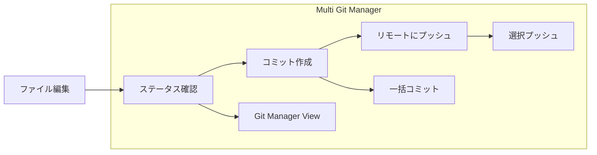

# Language / 言語 / 语言
**[English](../en/quick-start.md)** | **[日本語](../ja/quick-start.md)** | **[简体中文](../zh-CN/quick-start.md)** | **[繁體中文](../zh-TW/quick-start.md)**

---

# 🚀 クイックスタートガイド

## 5分でできる！プラグインインストール

### 📋 前提条件チェック
```bash
# 1. Gitがインストールされているか確認
git --version
# ✅ git version 2.x.x が表示されればOK

# 2. Node.jsがインストールされているか確認 (開発時のみ)
node --version
# ✅ v16.x.x 以上が表示されればOK
```

### ⚡ 超簡単インストール (3ステップ)

#### Step 1: ビルド実行
```bash
cd D:\Project\2510_obsidianGit\obsidian-multi-git-plugin
npm install && npm run build
```

#### Step 2: ファイルコピー
```bash
# あなたのObsidian Vaultの .obsidian/plugins/ フォルダに以下をコピー:
# 📁 main.js
# 📁 manifest.json  
# 📁 styles.css
```

#### Step 3: Obsidianで有効化
1. Obsidian起動
2. 設定 ⚙️ → コミュニティプラグイン → **Multi Git Manager** をON

## 🎯 即座に使える機能

### ① ステータス確認
- **ステータスバー** に「Git: X changes」と表示
- リアルタイムで変更ファイル数を監視

### ② Git Manager View
- **左サイドバー** のGitアイコン 🌳 をクリック
- 全リポジトリの状況を一目で確認

### ③ コマンドパレット
`Ctrl/Cmd + P` で以下のコマンドが使用可能:
- `Git: Show Status` - 詳細ステータス表示
- `Git: Commit` - 複数リポジトリ一括コミット
- `Git: Push` - リモートへプッシュ
- `Git: Pull` - リモートから取得

## 🔧 基本的な使い方

### 日常のワークフロー



### 1. 作業開始時
1. **Obsidianを開く**
2. **ステータスバー**で変更状況を確認
3. 必要に応じて**Git Manager View**を開く

### 2. 作業中
- ファイルを編集すると自動的にステータスが更新
- 複数のプロジェクト（リポジトリ）を同時作業可能

### 3. 作業終了時
1. **コマンドパレット** → `Git: Commit`
2. **コミットメッセージ** を入力
3. **対象リポジトリ** を選択
4. **Commit** ボタンをクリック

## 📊 対応するリポジトリタイプ

| タイプ | 説明 | 例 |
|--------|------|-----|
| **🏠 Vault** | Obsidian Vault自体 | `D:\MyVault\` |
| **📂 Parent** | Vault外のプロジェクト | `D:\Project\2510_obsidianGit\` |
| **📁 Subfolder** | Vault内のサブプロジェクト | `MyVault\subproject\` |

## ⚠️ トラブル時の対処法

### よくある問題と1分解決法

#### ❌ プラグインが見つからない
```bash
# 解決法: ファイルを正しい場所にコピー
ls "[VAULT]/.obsidian/plugins/multi-git-manager/"
# main.js, manifest.json, styles.css があることを確認
```

#### ❌ Gitコマンドエラー
```bash
# 解決法: Gitのパス確認
which git  # macOS/Linux
where git  # Windows
```

#### ❌ 「not a git repository」
```bash
# 解決法: Gitリポジトリとして初期化
cd "[YOUR_VAULT]"
git init
```

## 💡 便利な使い方Tips

### 🎯 プロ向けワークフロー

#### 1. 複数プロジェクト同時開発
```
📁 MyVault/
├── 🔄 notes/ (Gitリポジトリ)
├── 🔄 blog/ (Gitリポジトリ)  
└── 🔄 research/ (Gitリポジトリ)
```
→ **一括コミット**で全プロジェクトを同時更新

#### 2. 親子リポジトリ管理
```
📁 D:\Project\
├── 🔄 2510_obsidianGit/ (親リポジトリ)
└── 🔄 MyVault/ (子リポジトリ)
```
→ **選択プッシュ**で必要な部分のみ同期

#### 3. ブランチ戦略
- **main**: 安定版ノート
- **draft**: 下書き・実験
- **daily**: 日次メモ

## 🚀 次のステップ

### より高度な使い方
1. **GitManagerView**のカスタマイズ
2. **自動コミット**設定の調整
3. **複数ブランチ**での作業フロー

### 開発に参加
```bash
# 開発モードでの起動
npm run dev

# テストの実行
npm test

# カバレッジの確認
npm run test:coverage
```

---

## 🆘 困ったときは

### 即座にヘルプを得る方法
1. **開発者ツール** (`Ctrl+Shift+I`) でエラーログを確認
2. **コンソール**で `Multi Git Manager` を検索
3. **GitHub Issues** で既知の問題をチェック

### コミュニティサポート
- 📧 **Issues**: バグ報告・機能要望
- 💬 **Discussions**: 使い方相談
- 🔧 **Pull Requests**: 改善提案

---

**🎉 これでMulti Git Managerの基本的な使い方をマスターできました！**  
**効率的なGitワークフローをお楽しみください。**

*🤖 Created with Claude Code integration by Lean consultant Futaro (OfficeFutaro)*