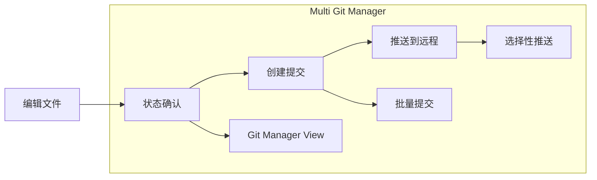

# Language / 言語 / 语言
**[English](../en/quick-start.md)** | **[日本語](../ja/quick-start.md)** | **[简体中文](../zh-CN/quick-start.md)** | **[繁體中文](../zh-TW/quick-start.md)**

---

# 🚀 快速入门指南

## 5分钟搞定！插件安装

### 📋 前提条件检查
```bash
# 1. 确认已安装 Git
git --version
# ✅ 显示 git version 2.x.x 即可

# 2. 确认已安装 Node.js (仅开发时需要)
node --version
# ✅ 显示 v16.x.x 或更高版本即可
```

### ⚡ 超简单安装 (3步骤)

#### 步骤 1: 执行构建
```bash
cd D:\Project\2510_obsidianGit\obsidian-multi-git-plugin
npm install && npm run build
```

#### 步骤 2: 复制文件
```bash
# 将以下文件复制到您的 Obsidian Vault 的 .obsidian/plugins/ 文件夹:
# 📁 main.js
# 📁 manifest.json  
# 📁 styles.css
```

#### 步骤 3: 在 Obsidian 中启用
1. 启动 Obsidian
2. 设置 ⚙️ → 社区插件 → 开启 **Multi Git Manager**

## 🎯 即可使用的功能

### ① 状态确认
- **状态栏** 显示「Git: X changes」
- 实时监控修改文件数量

### ② Git Manager View
- 点击 **左侧栏** 的 Git 图标 🌳
- 一目了然地查看所有仓库状况

### ③ 命令面板
`Ctrl/Cmd + P` 可使用以下命令:
- `Git: Show Status` - 详细状态显示
- `Git: Commit` - 多仓库批量提交
- `Git: Push` - 推送到远程
- `Git: Pull` - 从远程获取

## 🔧 基本使用方法

### 日常工作流程



### 1. 开始工作时
1. **打开 Obsidian**
2. 通过 **状态栏** 确认变更状况
3. 必要时打开 **Git Manager View**

### 2. 工作中
- 编辑文件时状态会自动更新
- 可同时操作多个项目（仓库）

### 3. 工作结束时
1. **命令面板** → `Git: Commit`
2. 输入 **提交消息**
3. 选择 **目标仓库**
4. 点击 **Commit** 按钮

## 📊 支持的仓库类型

| 类型 | 说明 | 示例 |
|--------|------|-----|
| **🏠 Vault** | Obsidian Vault 本身 | `D:\MyVault\` |
| **📂 Parent** | Vault 外的项目 | `D:\Project\2510_obsidianGit\` |
| **📁 Subfolder** | Vault 内的子项目 | `MyVault\subproject\` |

## ⚠️ 故障处理方法

### 常见问题的1分钟解决法

#### ❌ 找不到插件
```bash
# 解决方法: 将文件复制到正确位置
ls "[VAULT]/.obsidian/plugins/multi-git-manager/"
# 确认存在 main.js, manifest.json, styles.css
```

#### ❌ Git 命令错误
```bash
# 解决方法: 确认 Git 路径
which git  # macOS/Linux
where git  # Windows
```

#### ❌ 「not a git repository」
```bash
# 解决方法: 初始化为 Git 仓库
cd "[YOUR_VAULT]"
git init
```

## 💡 实用技巧

### 🎯 专业级工作流程

#### 1. 多项目同时开发
```
📁 MyVault/
├── 🔄 notes/ (Git仓库)
├── 🔄 blog/ (Git仓库)  
└── 🔄 research/ (Git仓库)
```
→ 通过 **批量提交** 同时更新所有项目

#### 2. 父子仓库管理
```
📁 D:\Project\
├── 🔄 2510_obsidianGit/ (父仓库)
└── 🔄 MyVault/ (子仓库)
```
→ 通过 **选择性推送** 仅同步需要的部分

#### 3. 分支策略
- **main**: 稳定版笔记
- **draft**: 草稿・实验
- **daily**: 每日备忘录

## 🚀 下一步

### 更高级的用法
1. **GitManagerView** 的自定义
2. **自动提交** 设置调整
3. **多分支** 工作流程

### 参与开发
```bash
# 开发模式启动
npm run dev

# 运行测试
npm test

# 确认覆盖率
npm run test:coverage
```

---

## 🆘 遇到困难时

### 快速获取帮助的方法
1. **开发者工具** (`Ctrl+Shift+I`) 确认错误日志
2. 在 **控制台** 搜索 `Multi Git Manager`
3. 在 **GitHub Issues** 检查已知问题

### 社区支持
- 📧 **Issues**: 错误报告・功能需求
- 💬 **Discussions**: 使用咨询
- 🔧 **Pull Requests**: 改进建议

---

**🎉 现在您已经掌握了 Multi Git Manager 的基本使用方法！**  
**请享受高效的 Git 工作流程。**

*🤖 Created with Claude Code integration by Lean consultant Futaro (OfficeFutaro)*