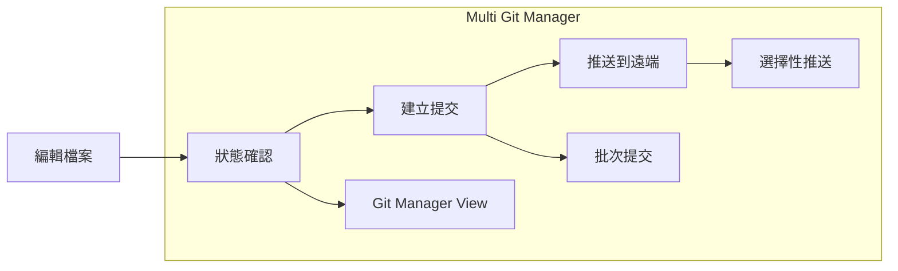

# Language / 言語 / 语言
**[English](../en/quick-start.md)** | **[日本語](../ja/quick-start.md)** | **[简体中文](../zh-CN/quick-start.md)** | **[繁體中文](../zh-TW/quick-start.md)**

---

# 🚀 快速入門指南

## 5分鐘搞定！外掛安裝

### 📋 前提條件檢查
```bash
# 1. 確認已安裝 Git
git --version
# ✅ 顯示 git version 2.x.x 即可

# 2. 確認已安裝 Node.js (僅開發時需要)
node --version
# ✅ 顯示 v16.x.x 或更高版本即可
```

### ⚡ 超簡單安裝 (3步驟)

#### 步驟 1: 執行建置
```bash
cd D:\Project\2510_obsidianGit\obsidian-multi-git-plugin
npm install && npm run build
```

#### 步驟 2: 複製檔案
```bash
# 將以下檔案複製到您的 Obsidian Vault 的 .obsidian/plugins/ 資料夾:
# 📁 main.js
# 📁 manifest.json  
# 📁 styles.css
```

#### 步驟 3: 在 Obsidian 中啟用
1. 啟動 Obsidian
2. 設定 ⚙️ → 社群外掛 → 開啟 **Multi Git Manager**

## 🎯 即可使用的功能

### ① 狀態確認
- **狀態列** 顯示「Git: X changes」
- 即時監控修改檔案數量

### ② Git Manager View
- 點擊 **左側欄** 的 Git 圖示 🌳
- 一目瞭然地檢視所有儲存庫狀況

### ③ 命令選擇器
`Ctrl/Cmd + P` 可使用以下命令:
- `Git: Show Status` - 詳細狀態顯示
- `Git: Commit` - 多儲存庫批次提交
- `Git: Push` - 推送到遠端
- `Git: Pull` - 從遠端取得

## 🔧 基本使用方法

### 日常工作流程



### 1. 開始工作時
1. **開啟 Obsidian**
2. 透過 **狀態列** 確認變更狀況
3. 必要時開啟 **Git Manager View**

### 2. 工作中
- 編輯檔案時狀態會自動更新
- 可同時操作多個專案（儲存庫）

### 3. 工作結束時
1. **命令選擇器** → `Git: Commit`
2. 輸入 **提交訊息**
3. 選擇 **目標儲存庫**
4. 點擊 **Commit** 按鈕

## 📊 支援的儲存庫類型

| 類型 | 說明 | 範例 |
|--------|------|-----|
| **🏠 Vault** | Obsidian Vault 本身 | `D:\MyVault\` |
| **📂 Parent** | Vault 外的專案 | `D:\Project\2510_obsidianGit\` |
| **📁 Subfolder** | Vault 內的子專案 | `MyVault\subproject\` |

## ⚠️ 故障處理方法

### 常見問題的1分鐘解決法

#### ❌ 找不到外掛
```bash
# 解決方法: 將檔案複製到正確位置
ls "[VAULT]/.obsidian/plugins/multi-git-manager/"
# 確認存在 main.js, manifest.json, styles.css
```

#### ❌ Git 命令錯誤
```bash
# 解決方法: 確認 Git 路徑
which git  # macOS/Linux
where git  # Windows
```

#### ❌ 「not a git repository」
```bash
# 解決方法: 初始化為 Git 儲存庫
cd "[YOUR_VAULT]"
git init
```

## 💡 實用技巧

### 🎯 專業級工作流程

#### 1. 多專案同時開發
```
📁 MyVault/
├── 🔄 notes/ (Git儲存庫)
├── 🔄 blog/ (Git儲存庫)  
└── 🔄 research/ (Git儲存庫)
```
→ 透過 **批次提交** 同時更新所有專案

#### 2. 父子儲存庫管理
```
📁 D:\Project\
├── 🔄 2510_obsidianGit/ (父儲存庫)
└── 🔄 MyVault/ (子儲存庫)
```
→ 透過 **選擇性推送** 僅同步需要的部分

#### 3. 分支策略
- **main**: 穩定版筆記
- **draft**: 草稿・實驗
- **daily**: 每日備忘錄

## 🚀 下一步

### 更進階的用法
1. **GitManagerView** 的自訂
2. **自動提交** 設定調整
3. **多分支** 工作流程

### 參與開發
```bash
# 開發模式啟動
npm run dev

# 執行測試
npm test

# 確認覆蓋率
npm run test:coverage
```

---

## 🆘 遇到困難時

### 快速取得協助的方法
1. **開發者工具** (`Ctrl+Shift+I`) 確認錯誤日誌
2. 在 **主控台** 搜尋 `Multi Git Manager`
3. 在 **GitHub Issues** 檢查已知問題

### 社群支援
- 📧 **Issues**: 錯誤回報・功能需求
- 💬 **Discussions**: 使用諮詢
- 🔧 **Pull Requests**: 改善建議

---

**🎉 現在您已經掌握了 Multi Git Manager 的基本使用方法！**  
**請享受高效的 Git 工作流程。**

*🤖 Created with Claude Code integration by Lean consultant Futaro (OfficeFutaro)*